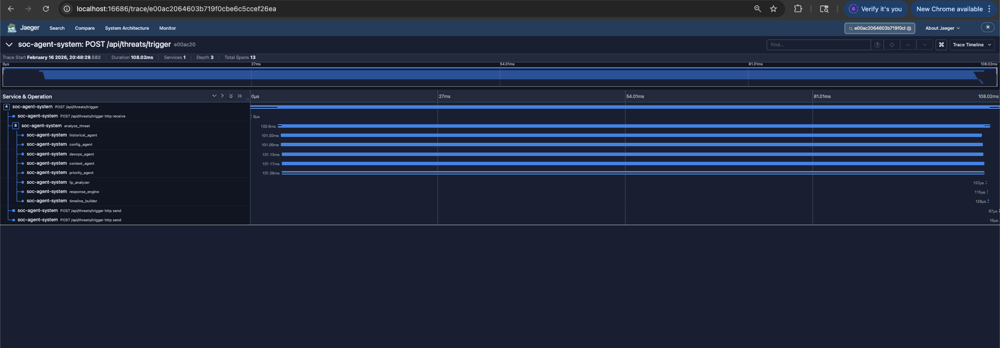
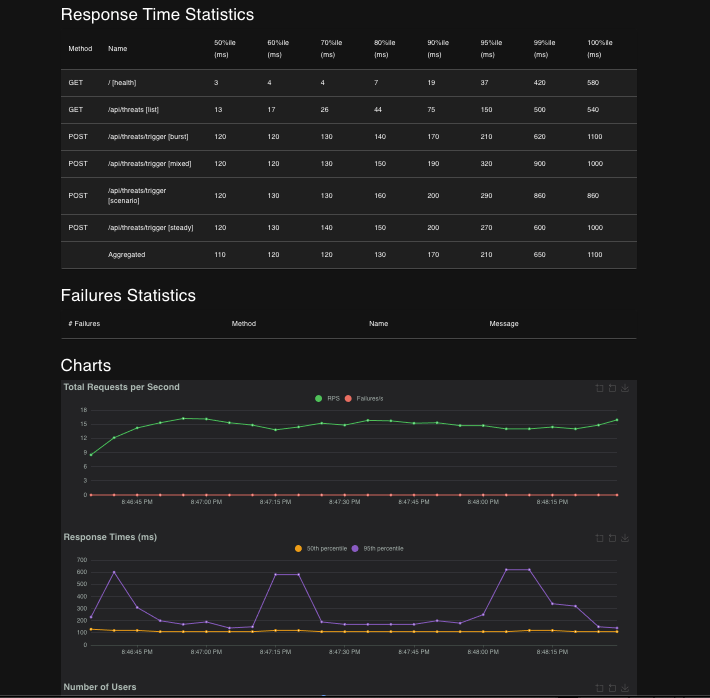
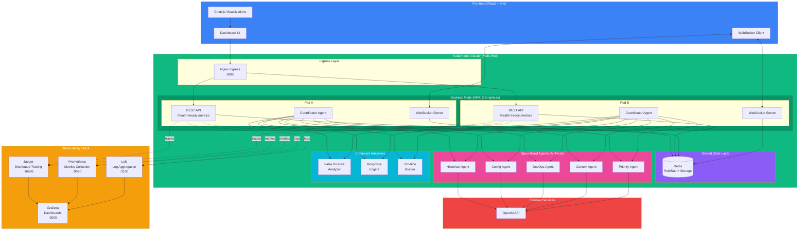
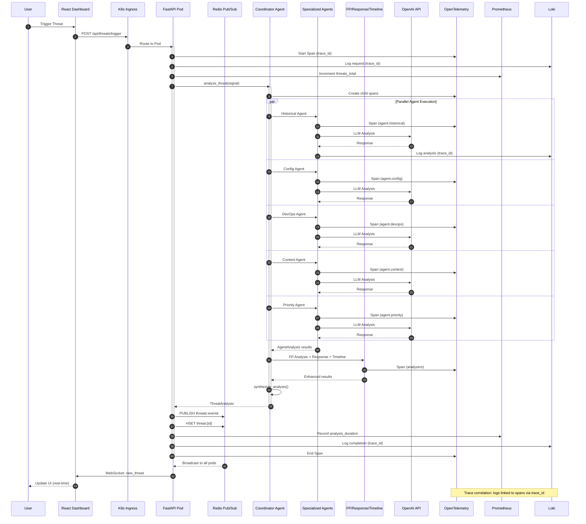
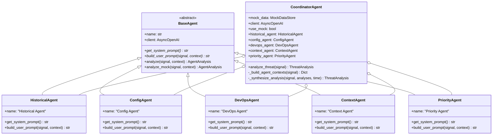
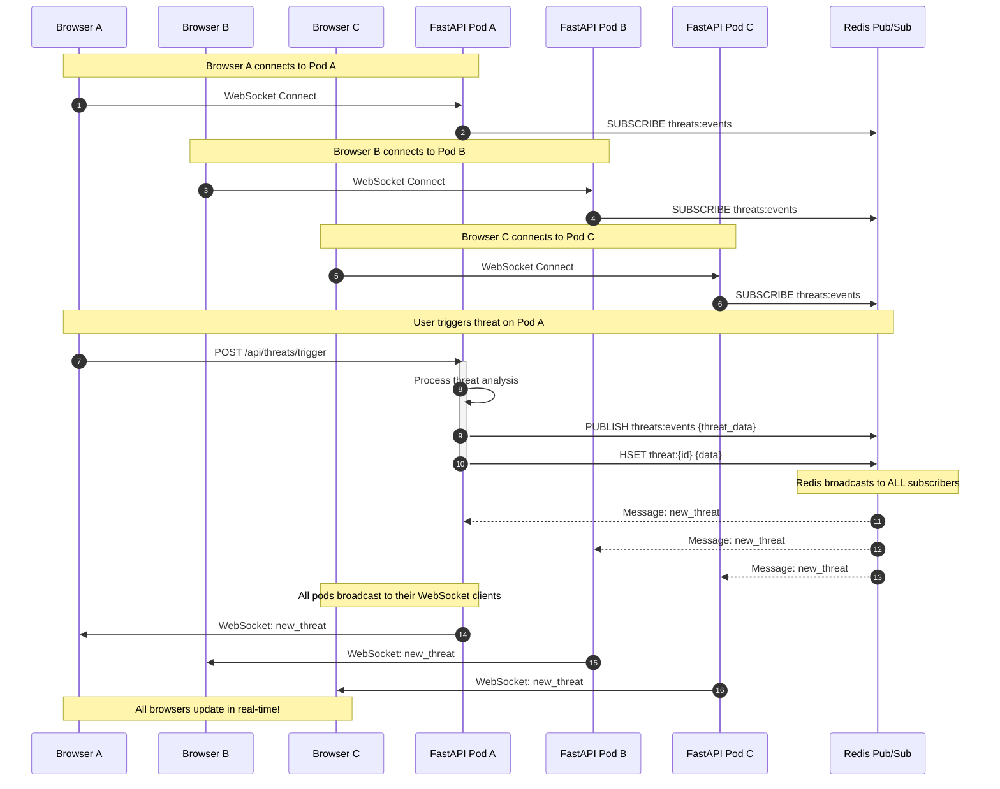
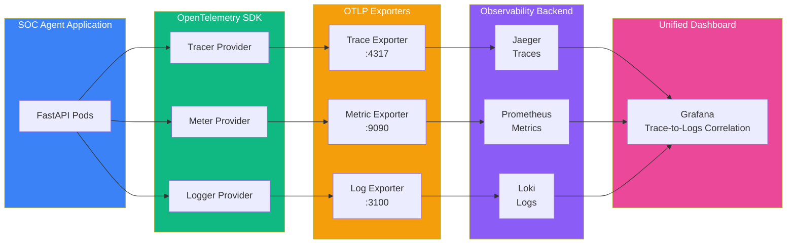

# SOC Agent System

A multi-agent Security Operations Center (SOC) system with real-time threat intelligence dashboard.

## 📸 Screenshots

### Dashboard Overview

*Real-time threat monitoring dashboard with statistics, threat type distribution, and severity analysis*

### Threat Feed

*Live threat feed showing recent security incidents with severity levels and processing times*

### Detailed Threat Analysis

*Comprehensive threat analysis with false positive scoring, response recommendations, and investigation timeline*

### Investigation Timeline & Raw Data

*Forensic timeline reconstruction with raw signal metadata and agent inference details*

### Observability & Performance Monitoring


*Pre-configured SOC Agent metrics and visualizations with Grafana*


*Real-time metrics collection and querying with Prometheus*


*End-to-end request tracing with performance analysis using Jaeger*


*Performance testing results and load testing reports with Locust*

## 📑 Table of Contents

- [Screenshots](#-screenshots)
- [Architecture](#️-architecture)
  - [System Overview](#system-overview)
  - [Request Flow](#request-flow)
  - [Agent Architecture](#agent-architecture)
- [Prerequisites](#-prerequisites)
- [Quick Start](#-quick-start)
  - [Clone the Repository](#1-clone-the-repository)
  - [Backend Setup](#2-backend-setup)
  - [Frontend Setup](#3-frontend-setup)
- [Running the Application](#-running-the-application)
  - [Start Backend Server](#step-1-start-backend-server)
  - [Start Frontend Development Server](#step-2-start-frontend-development-server)
  - [Access the Dashboard](#step-3-access-the-dashboard)
- [Enhanced Logging](#-enhanced-logging)
  - [Logging Modes](#logging-modes)
  - [Switching Logging Levels](#switching-logging-levels)
  - [What You'll See](#what-youll-see)
- [Running Tests](#-running-tests)
  - [Backend Tests](#backend-tests)
  - [Frontend Tests](#frontend-tests)
- [Kubernetes Deployment](#-kubernetes-deployment)
  - [Prerequisites](#prerequisites-1)
  - [Quick Start with Kind](#quick-start-with-kind-local-testing)
  - [Helm Chart Configuration](#helm-chart-configuration)
  - [Custom Deployment](#custom-deployment)
  - [Integration Tests](#integration-tests)
  - [Architecture Highlights](#architecture-highlights)
  - [Monitoring and Observability](#monitoring-and-observability)
  - [Troubleshooting](#troubleshooting-1)
- [Troubleshooting](#-troubleshooting)
- [Using the Dashboard](#-using-the-dashboard)
- [API Endpoints](#-api-endpoints)
- [System Components](#-system-components)
- [Technology Stack](#️-technology-stack)
- [Configuration](#-configuration)
- [License](#-license)
- [Contributing](#-contributing)
- [Support](#-support)

## 🏗️ Architecture

- **Backend**: Python/FastAPI with 5 specialized AI agents
- **Frontend**: React/Vite with real-time WebSocket updates
- **Agents**: Historical, Config, DevOps, Context, Priority
- **Coordinator**: Parallel agent execution orchestrator

### System Overview



### Request Flow with Observability



### Agent Architecture



### Multi-Pod Real-Time Broadcasting



### Observability Integration



## 📋 Prerequisites

- **Python 3.9 - 3.12** (⚠️ Python 3.13+ not yet supported due to pydantic-core compatibility)
- **Node.js 18+** and npm
- **Git**

> **Note**: If you have Python 3.13 installed, use Python 3.9, 3.11, or 3.12 instead. Check your version with `python3 --version`.

## 🚀 Quick Start

### 1. Clone the Repository

```bash
git clone <repository-url>
cd ai-soc
```

### 2. Backend Setup

```bash
# Navigate to backend directory
cd soc-agent-system/backend

# Check your Python version (must be 3.9-3.12)
python3 --version

# If you have Python 3.13, use a specific version instead:
# python3.12 -m venv venv  # or python3.11 or python3.9

# Create virtual environment with Python 3.9-3.12
python3 -m venv venv

# Activate virtual environment
source venv/bin/activate  # On macOS/Linux
# OR
venv\Scripts\activate     # On Windows

# Verify Python version in virtual environment
python --version  # Should show 3.9.x - 3.12.x

# Install dependencies
pip install --upgrade pip
pip install -r requirements.txt

# Create .env file (copy from example)
cp .env.example .env

# Edit .env and add your OpenAI API key (optional - system works in mock mode without it)
# OPENAI_API_KEY=your-key-here
```

> **⚠️ Troubleshooting**: If you get a `pydantic-core` build error, you're likely using Python 3.13+. Delete the `venv` folder and recreate it with Python 3.9-3.12.

### 3. Frontend Setup

```bash
# Navigate to frontend directory (from project root)
cd soc-agent-system/frontend

# Install dependencies
npm install
```

## 🎯 Running the Application

**IMPORTANT**: Start components in this order:

### Step 1: Start Backend Server

```bash
# From soc-agent-system/backend directory
# Make sure virtual environment is activated
source venv/bin/activate

# Start the backend server
PYTHONPATH=src uvicorn main:app --reload --host 0.0.0.0 --port 8000
```

**Expected output:**
```
INFO:     Uvicorn running on http://0.0.0.0:8000 (Press CTRL+C to quit)
INFO:     Started reloader process [xxxxx] using WatchFiles
INFO:     Started server process [xxxxx]
INFO:     Waiting for application startup.
INFO:     Application startup complete.
```

**Verify backend is running:**
```bash
# In a new terminal
curl http://localhost:8000/
```

### Step 2: Start Frontend Development Server

```bash
# From soc-agent-system/frontend directory
npm run dev
```

**Expected output:**
```
VITE v7.3.1  ready in XXX ms

➜  Local:   http://localhost:5173/
➜  Network: use --host to expose
```

### Step 3: Access the Dashboard

Open your browser to: **http://localhost:5173/**

## 📝 Enhanced Logging

The SOC Agent System includes comprehensive logging to help you demo and understand the system's capabilities.

### Logging Modes

The system supports three logging modes:

#### 1. **Minimal Mode (Default)** - Standard Demos
- **Level**: INFO
- **Colors**: Enabled
- **Shows**: Key events, agent start/complete, final results
- **Best for**: Standard demonstrations, production monitoring

#### 2. **Detailed Mode** - Technical Demos
- **Level**: DEBUG
- **Colors**: Enabled
- **Shows**: All of minimal mode + prompt details, API calls, data queries
- **Best for**: Detailed technical demos, debugging, development

#### 3. **Production Mode** - Production Monitoring
- **Level**: INFO
- **Colors**: Disabled (for log aggregation)
- **Shows**: Key events without colors
- **Best for**: Production deployments, log aggregation systems

### Switching Logging Levels

Edit `soc-agent-system/backend/src/main.py` (line 18):

```python
# For minimal logging (default)
from logging_config import demo_mode_minimal
demo_mode_minimal()

# For detailed logging
from logging_config import demo_mode_detailed
demo_mode_detailed()

# For production logging
from logging_config import demo_mode_production
demo_mode_production()
```

### What You'll See

**Minimal Mode (INFO level):**
```
🚀 SOC Agent System starting up...
   Mode: MOCK (no OpenAI API)
   Host: 0.0.0.0:8000
✅ SOC Agent System ready!

================================================================================
🚨 NEW THREAT DETECTED: bot_traffic
   Customer: Global Finance
   Signal ID: abc-123
================================================================================

📊 GATHERING CONTEXT FOR AGENTS...
   ✓ Historical: 3 similar incidents found
   ✓ Config: Retrieved settings for Global Finance
   ✓ DevOps: 5 recent infrastructure events
   ✓ Context: 2 relevant news items
   ✓ Priority: Context prepared for classification

🤖 DISPATCHING 5 AGENTS IN PARALLEL (MOCK MODE)...
   🔄 Historical Agent starting...
   ✅ Historical Agent completed in 102ms
      Confidence: 0.85
      Key Findings: 1
   🔄 Config Agent starting...
   ✅ Config Agent completed in 98ms
      Confidence: 0.85
      Key Findings: 1
   ... (3 more agents)

⚡ ALL AGENTS COMPLETED IN 105ms (parallel execution)

🔬 SYNTHESIZING FINAL ANALYSIS...

✅ ANALYSIS COMPLETE
   Severity: MEDIUM
   Total Processing Time: 120ms
   Requires Human Review: False
================================================================================
```

**Detailed Mode (DEBUG level):**
All of the above PLUS:
- `[Agent Name] Building prompts for threat_type`
- `[Agent Name] Calling OpenAI API (model: gpt-4)`
- `[Agent Name] System prompt length: 1234 chars`
- `[Agent Name] User prompt length: 5678 chars`
- `[Agent Name] Received response from OpenAI`
- `[Agent Name] Parsed response - Confidence: 0.85`

### Demo Capabilities Visible Through Logging

- ✅ **Multi-agent coordination** - See the coordinator delegating work to 5 specialized agents
- ✅ **Parallel execution** - Watch all 5 agents analyze simultaneously with timing
- ✅ **Performance metrics** - Track processing time for each agent and overall analysis
- ✅ **Data source queries** - View context gathering from historical incidents, configs, infrastructure events, news
- ✅ **LLM interactions** - See prompts and API calls (in DEBUG mode)
- ✅ **Synthesis process** - Watch the coordinator combine agent insights into final analysis
- ✅ **Mode indicators** - Clear MOCK vs LIVE mode display

## 🧪 Running Tests

### Backend Tests

```bash
# From soc-agent-system/backend directory
# Make sure virtual environment is activated
source venv/bin/activate

# Run all tests
pytest tests/ -v

# Run specific test file
pytest tests/test_agents.py -v
pytest tests/test_coordinator.py -v
pytest tests/test_threat_generator.py -v
pytest tests/test_api.py -v

# Run with coverage
pytest tests/ -v --cov=src --cov-report=html

# Run tests with short traceback
pytest tests/ -v --tb=short
```

**Expected result:** 43 tests passing

### Frontend Tests

```bash
# From soc-agent-system/frontend directory
npm test
```

## 🔧 Troubleshooting

### Backend Port Already in Use

If you see `ERROR: [Errno 48] Address already in use`:

```bash
# Find and kill process on port 8000
lsof -ti:8000 | xargs kill -9

# Then restart the backend server
```

### Frontend Port Already in Use

If port 5173 is in use, Vite will automatically try the next available port (5174, 5175, etc.)

### Backend Not Responding

1. Check if backend is running: `curl http://localhost:8000/`
2. Check backend logs in the terminal where you started it
3. Verify virtual environment is activated
4. Ensure all dependencies are installed: `pip install -r requirements.txt`

### WebSocket Connection Failed

1. Ensure backend is running on port 8000
2. Check browser console for WebSocket errors
3. Verify proxy configuration in `frontend/vite.config.js`

## 📊 Using the Dashboard

### Generate Threats

Click one of the trigger buttons:
- **Trigger Bot Attack**: Simulates bot traffic scenario
- **Trigger Crypto Surge**: Simulates cryptocurrency mining activity
- **Trigger Impossible Travel**: Simulates geo-anomaly (impossible travel)
- **Trigger Random**: Generates a random threat type

### View Threat Details

- Click "Show Details" on any threat to see:
  - All 5 agent analyses
  - Confidence scores
  - Key findings and recommendations
  - MITRE ATT&CK tactics and techniques
  - Signal metadata

### Real-time Updates

- Connection status indicator (top right) shows WebSocket status
- New threats appear automatically via WebSocket
- Charts and metrics update in real-time

## 🔑 API Endpoints

### REST API

- `GET /` - Health check
- `GET /api/threats` - List all threats (supports pagination)
- `GET /api/threats/{id}` - Get specific threat
- `POST /api/threats/trigger` - Manually trigger threat generation
- `GET /api/analytics` - Get dashboard analytics

### WebSocket

- `WS /ws` - Real-time threat updates

## 🧩 System Components

### Backend Agents

1. **Historical Agent**: Pattern recognition from past incidents
2. **Config Agent**: Configuration analysis specialist
3. **DevOps Agent**: Infrastructure correlation specialist
4. **Context Agent**: Business context specialist
5. **Priority Agent**: MITRE ATT&CK mapping & prioritization

### Threat Types

- `bot_traffic` - Automated bot activity
- `proxy_network` - Proxy/VPN usage patterns
- `device_compromise` - Compromised device indicators
- `anomaly_detection` - Behavioral anomalies
- `rate_limit_breach` - Rate limit violations
- `geo_anomaly` - Geographic anomalies

### Severity Levels

- `LOW` - Minor threats
- `MEDIUM` - Moderate threats
- `HIGH` - Serious threats
- `CRITICAL` - Critical threats requiring immediate attention

## 🛠️ Technology Stack

### Backend
- Python 3.9+
- FastAPI 0.109.0
- Pydantic 2.5.3
- OpenAI 1.10.0 (optional - mock mode available)
- Uvicorn 0.27.0
- pytest 7.4.4

### Frontend
- React 19.2.0
- Vite 7.2.4
- Chart.js 4.4.1
- react-chartjs-2 5.2.0
- Axios 1.6.5

## 🚀 Kubernetes Deployment

The SOC Agent System includes production-ready Kubernetes deployment with Helm charts, comprehensive integration tests, and observability stack.

### Prerequisites

- **kubectl** - Kubernetes command-line tool
- **helm** - Kubernetes package manager (v3+)
- **kind** - Kubernetes in Docker (for local testing)
- **docker** - Container runtime

Install prerequisites on macOS:
```bash
brew install kubectl helm kind
```

### Quick Start with Kind (Local Testing)

1. **Create Kind cluster and deploy:**
```bash
cd soc-agent-system/k8s
./deploy.sh
```

This script will:
- Create a 3-node Kind cluster
- Build Docker images for backend and frontend
- Load images into Kind cluster
- Deploy the Helm chart with Redis enabled
- Wait for all pods to be ready

2. **Access the application:**
```bash
# Port-forward to access the frontend
kubectl port-forward -n soc-agent-test service/soc-agent-test-frontend 8080:80

# Access the dashboard at http://localhost:8080
```

3. **Run integration tests:**
```bash
cd soc-agent-system/k8s/tests
./integration_test.sh      # Deployment and health checks (9 tests)
./test_connectivity.sh     # E2E connectivity tests (10 tests)
```

4. **Cleanup:**
```bash
cd soc-agent-system/k8s
./teardown.sh
kind delete cluster --name soc-agent-cluster
```

### Helm Chart Configuration

The Helm chart is located in `soc-agent-system/k8s/charts/soc-agent/` and supports:

- **Backend**: 2 replicas (default), HPA enabled (2-8 replicas based on 70% CPU)
- **Frontend**: 1 replica with nginx serving React app
- **Redis**: Single instance for cross-pod state sharing (optional, enabled by default)
- **Ingress**: Optional ingress controller support
- **Health Probes**: Liveness (`/health`) and readiness (`/ready`) checks

**Key configuration values** (`values.yaml`):
```yaml
backend:
  replicas: 2
  image:
    repository: soc-backend
    tag: latest
    pullPolicy: Never  # For Kind, use IfNotPresent for real clusters
  autoscaling:
    enabled: true
    minReplicas: 2
    maxReplicas: 8
    targetCPUUtilizationPercentage: 70

frontend:
  replicas: 1
  image:
    repository: soc-frontend
    tag: latest
    pullPolicy: Never

redis:
  enabled: true
  image:
    repository: redis
    tag: 7-alpine
```

### Custom Deployment

Deploy to an existing Kubernetes cluster:

```bash
# Build and push images to your registry
docker build -t your-registry/soc-backend:v1.0 soc-agent-system/backend
docker build -t your-registry/soc-frontend:v1.0 soc-agent-system/frontend
docker push your-registry/soc-backend:v1.0
docker push your-registry/soc-frontend:v1.0

# Deploy with Helm
helm install soc-agent soc-agent-system/k8s/charts/soc-agent \
  --namespace soc-agent \
  --create-namespace \
  --set backend.image.repository=your-registry/soc-backend \
  --set backend.image.tag=v1.0 \
  --set backend.image.pullPolicy=IfNotPresent \
  --set frontend.image.repository=your-registry/soc-frontend \
  --set frontend.image.tag=v1.0 \
  --set frontend.image.pullPolicy=IfNotPresent \
  --set redis.enabled=true
```

### Integration Tests

The test suite validates:

**Integration Tests** (`integration_test.sh`):
- ✅ Prerequisites (kubectl, helm, kind)
- ✅ Helm chart deployment
- ✅ Pod readiness (backend, frontend, redis)
- ✅ Service existence
- ✅ Backend health endpoint

**Connectivity Tests** (`test_connectivity.sh`):
- ✅ Backend API endpoints (`/health`, `/ready`, `/metrics`, `/api/threats`)
- ✅ Frontend accessibility
- ✅ E2E threat creation and retrieval
- ✅ Redis connectivity from backend pods

**Run all tests:**
```bash
cd soc-agent-system/k8s/tests
./integration_test.sh && ./test_connectivity.sh
```

### Architecture Highlights

**Dynamic Backend URL Configuration:**
- Frontend nginx uses environment variables (`BACKEND_HOST`, `BACKEND_PORT`)
- Works seamlessly in both Docker Compose and Kubernetes
- Helm chart automatically sets correct service names

**Redis Pub/Sub for Multi-Pod State:**
- Backend uses Redis for cross-pod threat storage
- Pub/Sub broadcasts threat updates to all replicas
- Falls back to in-memory store if Redis unavailable

**Horizontal Pod Autoscaling:**
- Automatically scales backend pods (2-8 replicas)
- Based on CPU utilization (70% target)
- Handles traffic spikes gracefully

### Monitoring and Observability

The system includes production-grade observability:

- **Prometheus Metrics**: `/metrics` endpoint on backend
- **Structured JSON Logging**: Loki-compatible logs
- **OpenTelemetry Tracing**: Distributed tracing support
- **Health Checks**: Kubernetes-native liveness and readiness probes

See the [Screenshots](#-screenshots) section for Grafana, Prometheus, Jaeger, and Locust dashboards.

For the full observability stack configuration, see `soc-agent-system/observability/` (Prometheus, Grafana, Jaeger, Loki).

### Troubleshooting

**Pods not starting:**
```bash
kubectl get pods -n soc-agent-test
kubectl describe pod <pod-name> -n soc-agent-test
kubectl logs <pod-name> -n soc-agent-test
```

**Frontend can't reach backend:**
- Check `BACKEND_HOST` and `BACKEND_PORT` environment variables in frontend pod
- Verify backend service exists: `kubectl get svc -n soc-agent-test`

**Redis connection issues:**
- Check `REDIS_URL` in backend pod: `kubectl exec -n soc-agent-test <backend-pod> -- env | grep REDIS_URL`
- Verify Redis pod is running: `kubectl get pods -n soc-agent-test -l app=redis`

For more details on integration tests, see [soc-agent-system/k8s/tests/README.md](soc-agent-system/k8s/tests/README.md)

## � Security Scanning Pipeline

The project includes a comprehensive security scanning pipeline with quality gates suitable for CI/CD integration.

### Quality Gates (Makefile)

```bash
cd soc-agent-system

# Run all quality gates (recommended before commit)
make quality-gate

# Individual checks
make lint              # Ruff linter (Python code quality)
make test              # Unit tests (35 tests, 68% coverage, ~1.5s)
make scan-secrets      # TruffleHog secret scanning
make scan-container    # Trivy container vulnerability scanning

# Integration tests (requires Redis)
make test-integration  # 5 Redis pub/sub tests

# Full pipeline
make all               # quality-gate + scan-container
```

### Security Tools

| Tool | Version | Purpose | Configuration |
|------|---------|---------|---------------|
| **ruff** | 0.15.1 | Python linter & formatter | `pyproject.toml` |
| **pytest** | Latest | Unit & integration tests | 60%+ coverage required |
| **TruffleHog** | 3.93.3 | Secret scanning | `.trufflehog-exclude.txt` |
| **Trivy** | 0.69.1 | Container vulnerability scanning | Scans backend/frontend images |

### Test Architecture

**Unit Tests** (35 tests):
- ✅ No external dependencies (Redis, OpenAI)
- ✅ Fast execution (~1.5 seconds)
- ✅ 68% code coverage
- ✅ Run in quality gate

**Integration Tests** (5 tests):
- ✅ Redis Pub/Sub validation
- ✅ Cross-pod state sharing
- ✅ Requires Redis running
- ✅ Run separately with `make test-integration`

### CI/CD Integration

Add to your CI pipeline:

```yaml
# Example GitHub Actions
- name: Run Quality Gates
  run: |
    cd soc-agent-system
    make quality-gate

- name: Scan Containers
  run: |
    cd soc-agent-system
    make scan-container
```

### Quality Gate Results

All checks must pass:
- ✅ **Linting**: No ruff violations
- ✅ **Tests**: 35/35 passing, 68% coverage
- ✅ **Secrets**: No exposed credentials
- ✅ **Containers**: No HIGH/CRITICAL vulnerabilities

## �📝 Configuration

### Backend Environment Variables

Edit `soc-agent-system/backend/.env`:

```env
# OpenAI API (optional - system works in mock mode without it)
OPENAI_API_KEY=your-key-here

# Server Configuration
HOST=0.0.0.0
PORT=8000
CORS_ORIGINS=http://localhost:5173,http://localhost:3000

# LLM Configuration
LLM_MODEL=gpt-4
LLM_TEMPERATURE=0.7
LLM_MAX_TOKENS=1000

# Threat Generation
THREAT_GENERATION_INTERVAL=30
MAX_STORED_THREATS=1000
```

## 📄 License

MIT License

## 🤝 Contributing

1. Fork the repository
2. Create a feature branch
3. Make your changes
4. Run tests to ensure everything passes
5. Submit a pull request

## 📞 Support

For issues and questions, please open an issue on GitHub.

