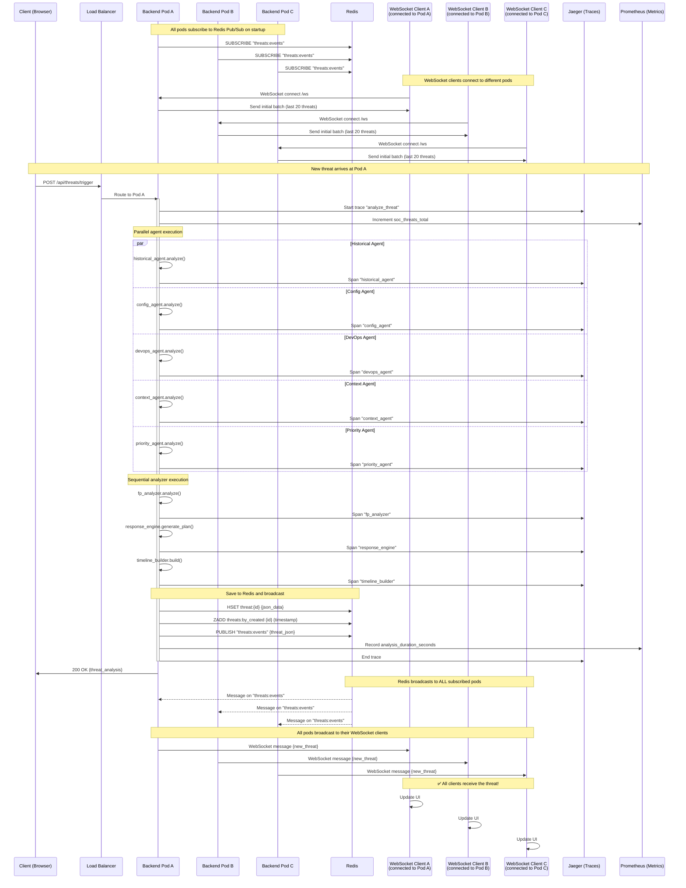

# SOC Agent System - Complete Architecture Documentation

## System Overview

The SOC Agent System is a multi-agent threat analysis platform that provides automated security operations center capabilities with ML-based false positive detection, automated response orchestration, and comprehensive investigation tracking.

---

## Table of Contents

1. [System Architecture](#system-architecture)
2. [Component Overview](#component-overview)
3. [Data Flow](#data-flow)
4. [Agent Architecture](#agent-architecture)
5. [New Analyzer Components](#new-analyzer-components)
6. [API Architecture](#api-architecture)
7. [Frontend Architecture](#frontend-architecture)
8. [Data Models](#data-models)
9. [Production-Ready Architecture](#production-ready-architecture)
   - [Redis Pub/Sub for Multi-Pod Broadcasting](#redis-pubsub-for-multi-pod-broadcasting)
   - [Observability Stack](#observability-stack)
   - [Kubernetes Deployment](#kubernetes-deployment)
10. [Deployment Architecture](#deployment-architecture)
11. [Integration Points](#integration-points)

---

## System Architecture

### High-Level Architecture (Production-Ready with Redis & Observability)

```
┌─────────────────────────────────────────────────────────────────────────────────┐
│                              PRESENTATION LAYER                                  │
│                                                                                  │
│  ┌──────────────┐  ┌──────────────┐  ┌──────────────┐  ┌──────────────┐       │
│  │   Dashboard  │  │ Threat List  │  │   Filters    │  │   Details    │       │
│  │              │  │ (Real-time)  │  │  (Multi-dim) │  │  (Tabbed)    │       │
│  └──────────────┘  └──────────────┘  └──────────────┘  └──────────────┘       │
│                                                                                  │
│  React Components + TailwindCSS + WebSocket Client                              │
└─────────────────────────────────────────────────────────────────────────────────┘
                                        │
                                        │ WebSocket / REST API
                                        │
┌─────────────────────────────────────────────────────────────────────────────────┐
│                         API GATEWAY LAYER (Multi-Pod)                            │
│                                                                                  │
│  ┌──────────────────────┐  ┌──────────────────────┐  ┌──────────────────────┐ │
│  │   FastAPI Pod A      │  │   FastAPI Pod B      │  │   FastAPI Pod C      │ │
│  │                      │  │                      │  │                      │ │
│  │  • POST /api/threats │  │  • POST /api/threats │  │  • POST /api/threats │ │
│  │  • GET  /api/threats │  │  • GET  /api/threats │  │  • GET  /api/threats │ │
│  │  • WS   /ws          │  │  • WS   /ws          │  │  • WS   /ws          │ │
│  │  • GET  /health      │  │  • GET  /health      │  │  • GET  /health      │ │
│  │  • GET  /ready       │  │  • GET  /ready       │  │  • GET  /ready       │ │
│  │  • GET  /metrics     │  │  • GET  /metrics     │  │  • GET  /metrics     │ │
│  └──────────┬───────────┘  └──────────┬───────────┘  └──────────┬───────────┘ │
│             │                         │                         │              │
│             └─────────────────────────┼─────────────────────────┘              │
│                                       │                                         │
│  Kubernetes Service (Load Balancer) + HorizontalPodAutoscaler                  │
└───────────────────────────────────────┼─────────────────────────────────────────┘
                                        │
                    ┌───────────────────┼───────────────────┐
                    │                   │                   │
                    ▼                   ▼                   ▼
┌─────────────────────────────────────────────────────────────────────────────────┐
│                            ORCHESTRATION LAYER                                   │
│                                                                                  │
│  ┌──────────────────────────────────────────────────────────────────┐          │
│  │                    COORDINATOR AGENT                              │          │
│  │                                                                    │          │
│  │  Responsibilities:                                                 │          │
│  │  • Receive threat signals                                          │          │
│  │  • Orchestrate parallel agent execution                            │          │
│  │  • Coordinate analyzer execution                                   │          │
│  │  • Aggregate results                                               │          │
│  │  • Determine severity and review requirements                      │          │
│  │  • Save to Redis (triggers Pub/Sub broadcast)                      │          │
│  │  • Emit OpenTelemetry traces                                       │          │
│  │  • Update Prometheus metrics                                       │          │
│  └──────────────────────────────────────────────────────────────────┘          │
│                                                                                  │
└─────────────────────────────────────────────────────────────────────────────────┘
                                        │
                    ┌───────────────────┴───────────────────┐
                    │                                       │
┌──────────────────────────────────────┐ ┌──────────────────────────────────────┐
│      ANALYSIS AGENTS LAYER           │ │    NEW ANALYZERS LAYER               │
│                                      │ │                                      │
│  ┌────────────────────────────────┐ │ │  ┌────────────────────────────────┐ │
│  │  Historical Analysis Agent     │ │ │  │  False Positive Analyzer       │ │
│  │  • Query past incidents        │ │ │  │  • User agent analysis         │ │
│  │  • Pattern matching            │ │ │  │  • IP reputation checking      │ │
│  │  • Resolution history          │ │ │  │  • Request volume analysis     │ │
│  └────────────────────────────────┘ │ │  │  • Historical FP rate          │ │
│                                      │ │  │  • Confidence scoring          │ │
│  ┌────────────────────────────────┐ │ │  └────────────────────────────────┘ │
│  │  Config/Context Agent          │ │ │                                      │
│  │  • Customer tier lookup        │ │ │  ┌────────────────────────────────┐ │
│  │  • Rate limit configuration    │ │ │  │  Response Action Engine        │ │
│  │  • Security settings           │ │ │  │  • Threat-severity mapping     │ │
│  └────────────────────────────────┘ │ │  │  • Action recommendation       │ │
│                                      │ │  │  • SLA calculation             │ │
│  ┌────────────────────────────────┐ │ │  │  • Escalation path building    │ │
│  │  DevOps Context Agent          │ │ │  └────────────────────────────────┘ │
│  │  • Deployment tracking         │ │ │                                      │
│  │  • Infrastructure events       │ │ │  ┌────────────────────────────────┐ │
│  │  • Config changes              │ │ │  │  Timeline Builder              │ │
│  └────────────────────────────────┘ │ │  │  • Event chronology            │ │
│                                      │ │  │  • Phase tracking              │ │
│  ┌────────────────────────────────┐ │ │  │  • Evidence chain              │ │
│  │  External Context Agent        │ │ │  └────────────────────────────────┘ │
│  │  • News monitoring             │ │ │                                      │
│  │  • Threat intel feeds          │ │ └──────────────────────────────────────┘
│  │  • CVE tracking                │ │
│  └────────────────────────────────┘ │
│                                      │
│  ┌────────────────────────────────┐ │
│  │  Priority/Severity Agent       │ │
│  │  • Risk scoring                │ │
│  │  • Severity classification     │ │
│  │  • MITRE ATT&CK mapping        │ │
│  └────────────────────────────────┘ │
└──────────────────────────────────────┘
                    │
                    │
┌─────────────────────────────────────────────────────────────────────────────────┐
│                          DATA & INFRASTRUCTURE LAYER                             │
│                                                                                  │
│  ┌──────────────────────────────────────────────────────────────────┐          │
│  │                    REDIS (Shared State)                           │          │
│  │                                                                    │          │
│  │  Storage:                                                          │          │
│  │  • threat:{id} → JSON (hash)                                      │          │
│  │  • threats:by_created → sorted set                                │          │
│  │                                                                    │          │
│  │  Pub/Sub:                                                          │          │
│  │  • Channel: "threats:events"                                      │          │
│  │  • Subscribers: All backend pods                                  │          │
│  │  • Enables cross-pod WebSocket broadcasting                       │          │
│  └──────────────────────────────────────────────────────────────────┘          │
│                                                                                  │
│  ┌──────────────────┐  ┌──────────────────┐  ┌──────────────────┐             │
│  │  Mock Data Store │  │   Event Store    │  │  Health Checks   │             │
│  │                  │  │                  │  │                  │             │
│  │  • Historical    │  │  • Audit logs    │  │  • Liveness      │             │
│  │    incidents     │  │  • Timeline      │  │  • Readiness     │             │
│  │  • Customer      │  │    events        │  │  • Redis health  │             │
│  │    configs       │  │  • Actions taken │  │                  │             │
│  │  • Infra events  │  │                  │  │                  │             │
│  └──────────────────┘  └──────────────────┘  └──────────────────┘             │
└─────────────────────────────────────────────────────────────────────────────────┘
                                        │
                                        │
┌─────────────────────────────────────────────────────────────────────────────────┐
│                          OBSERVABILITY STACK                                     │
│                                                                                  │
│  ┌──────────────┐  ┌──────────────┐  ┌──────────────┐  ┌──────────────┐       │
│  │   Jaeger     │  │  Prometheus  │  │  Loki        │  │   Grafana    │       │
│  │              │  │              │  │  + Promtail  │  │              │       │
│  │  Distributed │  │  Metrics     │  │  Log         │  │  Unified     │       │
│  │  Tracing     │  │  Collection  │  │  Aggregation │  │  Dashboard   │       │
│  │              │  │              │  │              │  │              │       │
│  │  • Spans     │  │  • Counters  │  │  • JSON logs │  │  • Metrics   │       │
│  │  • Traces    │  │  • Gauges    │  │  • Trace IDs │  │  • Traces    │       │
│  │  • Timeline  │  │  • Histogram │  │  • Filtering │  │  • Logs      │       │
│  └──────────────┘  └──────────────┘  └──────────────┘  └──────────────┘       │
│                                                                                  │
│  Three Pillars: Metrics, Traces, Logs (with correlation)                        │
└─────────────────────────────────────────────────────────────────────────────────┘
```

---

## Component Overview

### Core Components

| Component | Type | Purpose | Technology |
|-----------|------|---------|------------|
| **Frontend UI** | Presentation | User interface for SOC analysts | React, TailwindCSS |
| **API Gateway** | API Layer | REST/WebSocket endpoints | FastAPI, Python 3.9+ |
| **Coordinator Agent** | Orchestration | Multi-agent workflow management | Python async/await |
| **Analysis Agents** | Processing | Specialized threat analysis | Python agents |
| **FP Analyzer** | ML/Analytics | False positive detection | Python, statistical analysis |
| **Response Engine** | Automation | Action recommendation | Python, rule engine |
| **Timeline Builder** | Forensics | Event reconstruction | Python |
| **Data Store** | Persistence | Mock data and storage | In-memory (demo) |

### New Components Added

| Component | Lines of Code | Files | Test Coverage |
|-----------|---------------|-------|---------------|
| False Positive Analyzer | ~350 | 1 | 18 tests |
| Response Action Engine | ~400 | 1 | 17 tests |
| Timeline Builder | ~300 | 1 | 13 tests |
| Enhanced Data Models | ~600 | 1 (updated) | Model validation |
| Frontend Filters | ~400 | 2 | Manual testing |
| Test Script | ~450 | 1 | N/A (tooling) |
| Test Suite | ~2000 | 7 | 48+ tests |
| **Total** | **~4500** | **14** | **48+ tests** |

---

## Data Flow

### Threat Analysis Workflow

```
┌─────────────────┐
│  1. INGESTION   │
│                 │
│  Threat Signal  │
│  Received       │
└────────┬────────┘
         │
         ▼
┌─────────────────────────────────────────────┐
│  2. PARALLEL AGENT EXECUTION (Phase 1)      │
│                                             │
│  ┌──────────────┐  ┌──────────────┐        │
│  │  Historical  │  │   Config     │        │
│  │   Agent      │  │   Agent      │        │
│  └──────────────┘  └──────────────┘        │
│                                             │
│  ┌──────────────┐  ┌──────────────┐        │
│  │   DevOps     │  │  Context     │        │
│  │   Agent      │  │   Agent      │        │
│  └──────────────┘  └──────────────┘        │
│                                             │
│  ┌──────────────┐                           │
│  │  Priority    │                           │
│  │   Agent      │                           │
│  └──────────────┘                           │
│                                             │
│  All agents run concurrently                │
│  Duration: ~200-500ms each                  │
└────────┬────────────────────────────────────┘
         │
         ▼
┌─────────────────────────────────────────────┐
│  3. ENHANCED ANALYSIS (Phase 2)             │
│                                             │
│  ┌──────────────────────────────┐          │
│  │  False Positive Analyzer     │          │
│  │                              │          │
│  │  Inputs:                     │          │
│  │  • Threat signal             │          │
│  │  • All agent analyses        │          │
│  │  • Historical incidents      │          │
│  │                              │          │
│  │  Outputs:                    │          │
│  │  • FP Score (0-1)            │          │
│  │  • Confidence level          │          │
│  │  • Indicators list           │          │
│  │  • Recommendation            │          │
│  └──────────────────────────────┘          │
│                                             │
│  Duration: ~50-100ms                        │
└────────┬────────────────────────────────────┘
         │
         ▼
┌─────────────────────────────────────────────┐
│  4. RESPONSE PLANNING (Phase 3)             │
│                                             │
│  ┌──────────────────────────────┐          │
│  │  Response Action Engine      │          │
│  │                              │          │
│  │  Inputs:                     │          │
│  │  • Threat signal             │          │
│  │  • Severity level            │          │
│  │  • FP score                  │          │
│  │  • Customer config           │          │
│  │                              │          │
│  │  Outputs:                    │          │
│  │  • Primary action            │          │
│  │  • Secondary actions         │          │
│  │  • Escalation path           │          │
│  │  • SLA minutes               │          │
│  └──────────────────────────────┘          │
│                                             │
│  Duration: ~20-50ms                         │
└────────┬────────────────────────────────────┘
         │
         ▼
┌─────────────────────────────────────────────┐
│  5. TIMELINE CONSTRUCTION (Phase 4)         │
│                                             │
│  ┌──────────────────────────────┐          │
│  │  Timeline Builder            │          │
│  │                              │          │
│  │  Creates chronological view: │          │
│  │  1. Detection event          │          │
│  │  2. Enrichment events        │          │
│  │  3. Analysis events          │          │
│  │  4. Correlation events       │          │
│  │  5. Decision event           │          │
│  │  6. Action events            │          │
│  └──────────────────────────────┘          │
│                                             │
│  Duration: ~10-30ms                         │
└────────┬────────────────────────────────────┘
         │
         ▼
┌─────────────────────────────────────────────┐
│  6. RESULT AGGREGATION                      │
│                                             │
│  Enhanced Threat Analysis contains:         │
│  • Original signal                          │
│  • All agent analyses (5)                   │
│  • False positive score                     │
│  • Response plan                            │
│  • Investigation timeline                   │
│  • Severity classification                  │
│  • MITRE ATT&CK mapping                     │
│  • Review requirements                      │
│  • Total processing time                    │
└────────┬────────────────────────────────────┘
         │
         ▼
┌─────────────────────────────────────────────┐
│  7. REDIS STORAGE & PUB/SUB (NEW)           │
│                                             │
│  ┌──────────────────────────────┐          │
│  │  Redis Store                 │          │
│  │                              │          │
│  │  1. Save to Redis hash:      │          │
│  │     threat:{id} → JSON       │          │
│  │                              │          │
│  │  2. Add to sorted set:       │          │
│  │     threats:by_created       │          │
│  │                              │          │
│  │  3. PUBLISH to Pub/Sub:      │          │
│  │     Channel: threats:events  │          │
│  │     → ALL pods receive it!   │          │
│  └──────────────────────────────┘          │
│                                             │
│  Duration: ~5-10ms                          │
└────────┬────────────────────────────────────┘
         │
         │ Redis Pub/Sub Broadcast
         │
         ▼
┌─────────────────────────────────────────────┐
│  8. CROSS-POD WEBSOCKET DELIVERY (NEW)      │
│                                             │
│  All backend pods subscribe to Redis        │
│  Pub/Sub channel "threats:events"           │
│                                             │
│  ┌──────────┐  ┌──────────┐  ┌──────────┐ │
│  │  Pod A   │  │  Pod B   │  │  Pod C   │ │
│  │          │  │          │  │          │ │
│  │  WS: A,D │  │  WS: B,E │  │  WS: C   │ │
│  └──────────┘  └──────────┘  └──────────┘ │
│                                             │
│  ALL WebSocket clients receive the threat   │
│  regardless of which pod they're connected  │
│                                             │
│  • Update dashboard UI in real-time         │
│  • Trigger alerts if needed                 │
│  • Emit OpenTelemetry events                │
│  • Update Prometheus metrics                │
└─────────────────────────────────────────────┘

Total Duration: ~500-1000ms per threat (analysis)
                + ~5-10ms (Redis storage)
                + <1ms (WebSocket broadcast per client)
```

### Data Flow Metrics

| Phase | Components | Avg Duration | Parallelism |
|-------|-----------|--------------|-------------|
| Ingestion | API validation | <10ms | N/A |
| Agent Execution | 5 agents | 200-500ms | Fully parallel |
| FP Analysis | 1 analyzer | 50-100ms | Sequential |
| Response Planning | 1 engine | 20-50ms | Sequential |
| Timeline Build | 1 builder | 10-30ms | Sequential |
| **Total** | **8 components** | **500-1000ms** | **Mixed** |

---

## Agent Architecture

### Agent Communication Pattern

```
┌────────────────────────────────────────────────────────────┐
│                    COORDINATOR AGENT                       │
│                                                            │
│  async def analyze_threat(signal: ThreatSignal):          │
│      # Phase 1: Parallel agent execution                  │
│      agent_tasks = [                                       │
│          historical_agent.analyze(signal),                 │
│          config_agent.analyze(signal),                     │
│          devops_agent.analyze(signal),                     │
│          context_agent.analyze(signal),                    │
│          priority_agent.analyze(signal)                    │
│      ]                                                     │
│      agent_results = await asyncio.gather(*agent_tasks)   │
│                                                            │
│      # Phase 2: FP analysis (sequential)                   │
│      fp_score = fp_analyzer.analyze(                       │
│          signal, agent_results, historical_incidents       │
│      )                                                     │
│                                                            │
│      # Phase 3: Response planning (sequential)             │
│      response_plan = response_engine.generate_plan(        │
│          signal, severity, fp_score, customer_config       │
│      )                                                     │
│                                                            │
│      # Phase 4: Timeline construction (sequential)         │
│      timeline = timeline_builder.build(                    │
│          signal, agent_results, fp_score, response_plan    │
│      )                                                     │
│                                                            │
│      return EnhancedThreatAnalysis(...)                    │
└────────────────────────────────────────────────────────────┘
```

### Individual Agent Structure

Each analysis agent follows this pattern:

```python
class AnalysisAgent:
    """Base pattern for all analysis agents."""

    def __init__(self, agent_name: str, mock_data: MockDataStore):
        self.agent_name = agent_name
        self.mock_data = mock_data

    async def analyze(self, signal: ThreatSignal) -> AgentAnalysis:
        """
        Analyze threat signal and return structured analysis.

        Returns:
            AgentAnalysis with:
            - analysis: str (text summary)
            - confidence: float (0-1)
            - key_findings: List[str]
            - recommendations: List[str]
            - processing_time_ms: int
        """
        start_time = time.time()

        # Agent-specific analysis logic
        analysis_text = self._perform_analysis(signal)
        findings = self._extract_findings(signal)
        recommendations = self._generate_recommendations(signal)
        confidence = self._calculate_confidence(signal)

        processing_time = (time.time() - start_time) * 1000

        return AgentAnalysis(
            agent_name=self.agent_name,
            analysis=analysis_text,
            confidence=confidence,
            key_findings=findings,
            recommendations=recommendations,
            processing_time_ms=processing_time
        )
```

### Agent Responsibilities

| Agent | Primary Data Source | Key Outputs | Typical Confidence |
|-------|---------------------|-------------|-------------------|
| **Historical** | Past incidents DB | Similar cases, FP rate | 0.70-0.90 |
| **Config** | Customer settings | Rate limits, policies | 0.85-0.95 |
| **DevOps** | Infrastructure logs | Deployments, changes | 0.60-0.80 |
| **Context** | External feeds | News, threat intel | 0.50-0.75 |
| **Priority** | Risk models | Severity, MITRE map | 0.75-0.95 |

---

## New Analyzer Components

### False Positive Analyzer Architecture

```
┌────────────────────────────────────────────────────────────────┐
│             FALSE POSITIVE ANALYZER                             │
│                                                                 │
│  INPUT:                                                         │
│  • ThreatSignal                                                 │
│  • Dict[str, AgentAnalysis] (5 agents)                          │
│  • List[HistoricalIncident]                                     │
│                                                                 │
│  ┌──────────────────────────────────────────────────────────┐ │
│  │  ANALYSIS PIPELINE                                        │ │
│  │                                                            │ │
│  │  1. User Agent Analysis                                   │ │
│  │     • Check against benign list (Googlebot, etc.)         │ │
│  │     • Pattern matching (curl, python, etc.)               │ │
│  │     • Score impact: ±0.2                                  │ │
│  │                                                            │ │
│  │  2. IP Reputation Analysis                                │ │
│  │     • Known benign IPs (Google, AWS, CDNs)                │ │
│  │     • Internal IP detection (RFC1918)                     │ │
│  │     • Score impact: ±0.3                                  │ │
│  │                                                            │ │
│  │  3. Request Pattern Analysis                              │ │
│  │     • Volume/rate calculation                             │ │
│  │     • Endpoint analysis (health checks)                   │ │
│  │     • Score impact: ±0.15                                 │ │
│  │                                                            │ │
│  │  4. Historical FP Rate                                    │ │
│  │     • Similar incidents lookup                            │ │
│  │     • Resolution analysis (TP vs FP)                      │ │
│  │     • Score impact: ±0.2                                  │ │
│  │                                                            │ │
│  │  5. Agent Confidence Aggregation                          │ │
│  │     • Average confidence across agents                    │ │
│  │     • Low confidence = higher FP likelihood               │ │
│  │     • Score impact: ±0.15                                 │ │
│  └──────────────────────────────────────────────────────────┘ │
│                                                                 │
│  OUTPUT: FalsePositiveScore                                     │
│  • score: float (0-1, higher = more likely FP)                 │
│  • confidence: float (0-1, confidence in score)                │
│  • indicators: List[FPIndicator] (evidence items)              │
│  • recommendation: str (likely_fp | needs_review | likely_real)│
│  • explanation: str (human-readable reasoning)                 │
│  • historical_fp_rate: Optional[float]                         │
│  • similar_resolved_as_fp: int                                 │
│  • similar_resolved_as_real: int                               │
└────────────────────────────────────────────────────────────────┘
```

### Response Action Engine Architecture

```
┌────────────────────────────────────────────────────────────────┐
│             RESPONSE ACTION ENGINE                              │
│                                                                 │
│  INPUT:                                                         │
│  • ThreatSignal                                                 │
│  • ThreatSeverity (critical/high/medium/low)                    │
│  • FalsePositiveScore                                           │
│  • CustomerConfig                                               │
│  • Dict[str, AgentAnalysis]                                     │
│                                                                 │
│  ┌──────────────────────────────────────────────────────────┐ │
│  │  DECISION PIPELINE                                        │ │
│  │                                                            │ │
│  │  1. Template Selection                                    │ │
│  │     • Map (threat_type, severity) → response template     │ │
│  │     • Templates defined per threat scenario               │ │
│  │                                                            │ │
│  │  2. FP Score Adjustment                                   │ │
│  │     • High FP score (>0.7) → downgrade to monitor         │ │
│  │     • Low FP score (<0.3) → escalate response             │ │
│  │     • Mid FP score → keep base template                   │ │
│  │                                                            │ │
│  │  3. Customer Policy Check                                 │ │
│  │     • Auto-block enabled? → allow auto-execution          │ │
│  │     • Premium tier? → faster SLA                          │ │
│  │     • Whitelist check → prevent blocking                  │ │
│  │                                                            │ │
│  │  4. Action Prioritization                                 │ │
│  │     • Primary action (immediate)                          │ │
│  │     • Secondary actions (if primary fails)                │ │
│  │     • Backup actions                                      │ │
│  │                                                            │ │
│  │  5. Escalation Path Building                              │ │
│  │     • Tier assignment based on severity                   │ │
│  │     • Contact list from customer config                   │ │
│  │     • SLA calculation                                     │ │
│  └──────────────────────────────────────────────────────────┘ │
│                                                                 │
│  OUTPUT: ResponsePlan                                           │
│  • primary_action: ResponseAction                              │
│  • secondary_actions: List[ResponseAction]                     │
│  • escalation_path: List[str] (contact hierarchy)              │
│  • sla_minutes: int (response deadline)                        │
│  • overall_confidence: float                                   │
│                                                                 │
│  ResponseAction fields:                                         │
│  • action_type: block_ip | rate_limit | challenge | etc.       │
│  • urgency: immediate | urgent | normal | low                  │
│  • target: str (IP, user, endpoint)                            │
│  • parameters: dict (action-specific config)                   │
│  • auto_executable: bool                                       │
│  • requires_approval: bool                                     │
│  • estimated_impact: str                                       │
│  • confidence: float                                           │
└────────────────────────────────────────────────────────────────┘
```

### Timeline Builder Architecture

```
┌────────────────────────────────────────────────────────────────┐
│             TIMELINE BUILDER                                    │
│                                                                 │
│  INPUT:                                                         │
│  • ThreatSignal                                                 │
│  • Dict[str, AgentAnalysis]                                     │
│  • FalsePositiveScore                                           │
│  • ResponsePlan                                                 │
│  • ThreatSeverity                                               │
│                                                                 │
│  ┌──────────────────────────────────────────────────────────┐ │
│  │  EVENT GENERATION                                         │ │
│  │                                                            │ │
│  │  Phase 1: DETECTION                                       │ │
│  │  └─ Event: "Threat detected: {type}"                      │ │
│  │     Type: detection                                       │ │
│  │     Timestamp: signal.detected_at                         │ │
│  │                                                            │ │
│  │  Phase 2: ENRICHMENT                                      │ │
│  │  ├─ Event: "Historical data retrieved"                    │ │
│  │  ├─ Event: "Customer config loaded"                       │ │
│  │  ├─ Event: "DevOps context gathered"                      │ │
│  │  └─ Event: "External context checked"                     │ │
│  │     Type: enrichment                                      │ │
│  │     Timestamps: detection + agent processing times        │ │
│  │                                                            │ │
│  │  Phase 3: ANALYSIS                                        │ │
│  │  ├─ Event: "Historical analysis completed"                │ │
│  │  ├─ Event: "Config analysis completed"                    │ │
│  │  ├─ Event: "DevOps analysis completed"                    │ │
│  │  ├─ Event: "Context analysis completed"                   │ │
│  │  ├─ Event: "Priority analysis completed"                  │ │
│  │  └─ Event: "False positive analysis: {score}"             │ │
│  │     Type: analysis                                        │ │
│  │     Include: confidence, findings                         │ │
│  │                                                            │ │
│  │  Phase 4: CORRELATION                                     │ │
│  │  └─ Event: "Agent results correlated"                     │ │
│  │     Type: correlation                                     │ │
│  │     Details: Cross-agent insights                         │ │
│  │                                                            │ │
│  │  Phase 5: DECISION                                        │ │
│  │  └─ Event: "Threat classified as {severity}"              │ │
│  │     Type: decision                                        │ │
│  │     Include: severity, review requirement                 │ │
│  │                                                            │ │
│  │  Phase 6: ACTION                                          │ │
│  │  ├─ Event: "Primary action: {action_type}"                │ │
│  │  └─ Event: "Secondary action: {action_type}"              │ │
│  │     Type: action                                          │ │
│  │     Include: urgency, target, auto-executable             │ │
│  └──────────────────────────────────────────────────────────┘ │
│                                                                 │
│  OUTPUT: InvestigationTimeline                                 │
│  • events: List[TimelineEvent] (chronologically sorted)        │
│  • start_time: datetime                                        │
│  • end_time: datetime                                          │
│  • duration_ms: int                                            │
│  • phase_breakdown: Dict[str, int] (ms per phase)              │
└────────────────────────────────────────────────────────────────┘
```

---

## API Architecture

### REST Endpoints

```
FastAPI Application
├── POST /api/threats/trigger
│   ├── Request: ThreatSignal JSON
│   ├── Validation: Pydantic model
│   ├── Processing: 
│   │   └─ coordinator.analyze_threat(signal)
│   ├── Response: EnhancedThreatAnalysis JSON
│   └── Status: 200 OK | 422 Validation Error
│
├── GET /api/threats
│   ├── Query Params:
│   │   ├─ severity: critical|high|medium|low (optional)
│   │   ├─ status: pending|analyzing|completed (optional)
│   │   ├─ requires_review: true|false (optional)
│   │   ├─ search: string (optional)
│   │   └─ limit: int (default 100)
│   ├── Processing: Filter in-memory store
│   ├── Response: List[EnhancedThreatAnalysis]
│   └── Status: 200 OK
│
├── GET /api/threats/{threat_id}
│   ├── Path Param: threat_id (UUID)
│   ├── Processing: Lookup by ID
│   ├── Response: EnhancedThreatAnalysis
│   └── Status: 200 OK | 404 Not Found
│
└── WebSocket /ws
    ├── Connection: Bidirectional
    ├── Events: threat_created, threat_updated
    ├── Payload: EnhancedThreatAnalysis JSON
    └── Used by: Real-time dashboard updates
```

### Request/Response Flow

```
Client Request
    │
    ▼
┌─────────────────────┐
│  Request Validation │
│  (Pydantic Models)  │
└─────────┬───────────┘
          │ Valid
          ▼
┌─────────────────────┐
│  Route Handler      │
│  (async function)   │
└─────────┬───────────┘
          │
          ▼
┌─────────────────────┐
│  Coordinator Agent  │
│  analyze_threat()   │
└─────────┬───────────┘
          │
          ▼
┌─────────────────────┐
│  Result Storage     │
│  (in-memory dict)   │
└─────────┬───────────┘
          │
          ├─────────────────┐
          │                 │
          ▼                 ▼
┌─────────────────┐  ┌──────────────┐
│  HTTP Response  │  │  WebSocket   │
│  (JSON)         │  │  Broadcast   │
└─────────────────┘  └──────────────┘
```

---

## Frontend Architecture

### Component Hierarchy

```
App (Root)
│
├── Header
│   ├── Logo
│   ├── Stats (Total, Critical, High)
│   └── Dark Mode Toggle
│
├── ThreatFilters (NEW)
│   ├── Quick Filter: "Needs Review" badge
│   ├── Severity Filter (Multi-select)
│   ├── Status Filter (Multi-select)
│   └── Search Input
│
├── ThreatList
│   ├── Loading State
│   ├── Empty State
│   └── ThreatCard (mapped)
│       ├── Header (severity badge, customer)
│       ├── Metrics (IP, requests, timeframe)
│       ├── FP Score Badge (NEW)
│       ├── Response Action Badge (NEW)
│       ├── Requires Review Badge (conditional)
│       └── Expand Button
│
└── ThreatDetail (Expanded Card)
    ├── Tab Navigation
    │   ├── Overview
    │   ├── Agent Analyses
    │   ├── Timeline (NEW)
    │   ├── Response Actions (NEW)
    │   └── Raw Data
    │
    ├── Overview Tab
    │   ├── Severity & Status
    │   ├── MITRE ATT&CK Mapping
    │   ├── False Positive Score (NEW)
    │   └── Key Findings Summary
    │
    ├── Agent Analyses Tab
    │   └── AgentAnalysisCard (x5)
    │       ├── Agent Name
    │       ├── Confidence Bar
    │       ├── Analysis Text
    │       ├── Key Findings List
    │       └── Recommendations List
    │
    ├── Timeline Tab (NEW)
    │   └── TimelineEvent (mapped)
    │       ├── Icon (by event type)
    │       ├── Timestamp
    │       ├── Phase Label
    │       ├── Title
    │       ├── Description
    │       └── Details (expandable)
    │
    ├── Response Actions Tab (NEW)
    │   ├── Primary Action Card
    │   │   ├── Action Type Badge
    │   │   ├── Urgency Badge
    │   │   ├── Target
    │   │   ├── Confidence
    │   │   └── Execute Button (if auto-executable)
    │   ├── Secondary Actions List
    │   └── Escalation Path
    │       ├── SLA Timer
    │       └── Contact List
    │
    └── Raw Data Tab
        └── JSON Viewer (collapsible sections)
```

### State Management

```
React State Architecture

┌────────────────────────────────────────────┐
│  App Component (Root State)                │
│                                            │
│  State:                                    │
│  • threats: EnhancedThreatAnalysis[]       │
│  • filters: FilterState (NEW)              │
│  • expandedThreat: string | null           │
│  • stats: DashboardStats                   │
│                                            │
│  Effects:                                  │
│  • WebSocket connection on mount           │
│  • Subscribe to threat events              │
│  • Update stats on threat changes          │
│                                            │
│  Callbacks:                                │
│  • setFilters(newFilters) (NEW)            │
│  • toggleExpanded(threatId)                │
│  • refreshThreats()                        │
└────────────────────────────────────────────┘
         │
         │ Props passing
         │
         ├─────────────────────────┬──────────────────────┐
         │                         │                      │
         ▼                         ▼                      ▼
┌──────────────────┐  ┌──────────────────┐  ┌──────────────────┐
│  ThreatFilters   │  │   ThreatList     │  │     Header       │
│                  │  │                  │  │                  │
│  State:          │  │  State:          │  │  State:          │
│  • localFilters  │  │  • (none)        │  │  • darkMode      │
│                  │  │                  │  │                  │
│  Props:          │  │  Props:          │  │  Props:          │
│  • filters       │  │  • threats       │  │  • stats         │
│  • onFilterChange│  │  • expanded      │  │                  │
│                  │  │  • onToggle      │  │                  │
└──────────────────┘  └──────────────────┘  └──────────────────┘
                               │
                               │ Maps threats to cards
                               │
                               ▼
                      ┌──────────────────┐
                      │   ThreatCard     │
                      │                  │
                      │  State:          │
                      │  • activeTab     │
                      │                  │
                      │  Props:          │
                      │  • threat        │
                      │  • isExpanded    │
                      │  • onToggle      │
                      └──────────────────┘
```

### Filtering Logic (NEW)

```javascript
// Filter State Structure
const filters = {
  severity: ["critical", "high"],        // Multi-select
  status: [],                            // Multi-select (empty = all)
  requiresReview: null,                  // true | false | null
  search: ""                             // Text search
}

// Filter Application (client-side)
const filteredThreats = threats.filter(threat => {
  // Severity filter
  if (filters.severity.length > 0 && 
      !filters.severity.includes(threat.severity)) {
    return false;
  }

  // Status filter
  if (filters.status.length > 0 && 
      !filters.status.includes(threat.status)) {
    return false;
  }

  // Requires review filter
  if (filters.requiresReview !== null && 
      threat.requires_human_review !== filters.requiresReview) {
    return false;
  }

  // Search filter (customer name, threat type, IP)
  if (filters.search) {
    const searchLower = filters.search.toLowerCase();
    const matchesCustomer = threat.customer_name.toLowerCase()
      .includes(searchLower);
    const matchesType = threat.threat_type.toLowerCase()
      .includes(searchLower);
    const matchesIP = threat.source_ip.includes(searchLower);

    if (!matchesCustomer && !matchesType && !matchesIP) {
      return false;
    }
  }

  return true;
});
```

---

## Data Models

### Core Models Hierarchy

```
ThreatSignal (Input)
├── threat_type: str
├── customer_name: str
├── customer_id: str
├── source_ip: str
├── user_agent: Optional[str]
├── request_count: int
├── time_window_minutes: int
├── detected_at: datetime
└── raw_data: dict

AgentAnalysis (Agent Output)
├── agent_name: str
├── analysis: str
├── confidence: float
├── key_findings: List[str]
├── recommendations: List[str]
└── processing_time_ms: int

FalsePositiveScore (NEW - FP Analyzer Output)
├── score: float (0-1)
├── confidence: float (0-1)
├── indicators: List[FPIndicator]
├── recommendation: str
├── explanation: str
├── historical_fp_rate: Optional[float]
├── similar_resolved_as_fp: int
└── similar_resolved_as_real: int

FPIndicator (Supporting Model)
├── indicator: str
├── impact: float
└── category: str

ResponsePlan (NEW - Response Engine Output)
├── primary_action: ResponseAction
├── secondary_actions: List[ResponseAction]
├── escalation_path: List[str]
├── sla_minutes: int
└── overall_confidence: float

ResponseAction (Supporting Model)
├── action_type: ResponseActionType (enum)
├── urgency: ResponseUrgency (enum)
├── target: str
├── reason: str
├── parameters: dict
├── auto_executable: bool
├── requires_approval: bool
├── estimated_impact: str
└── confidence: float

InvestigationTimeline (NEW - Timeline Builder Output)
├── events: List[TimelineEvent]
├── start_time: datetime
├── end_time: datetime
├── duration_ms: int
└── phase_breakdown: Dict[str, int]

TimelineEvent (Supporting Model)
├── event_type: TimelineEventType (enum)
├── timestamp: datetime
├── phase: str
├── title: str
├── description: str
├── details: dict
├── severity: Optional[ThreatSeverity]
└── agent_name: Optional[str]

EnhancedThreatAnalysis (Final Output)
├── id: str (UUID)
├── signal: ThreatSignal
├── agent_analyses: Dict[str, AgentAnalysis]
├── false_positive_score: FalsePositiveScore (NEW)
├── response_plan: ResponsePlan (NEW)
├── investigation_timeline: InvestigationTimeline (NEW)
├── severity: ThreatSeverity
├── mitre_tactics: List[str]
├── mitre_techniques: List[str]
├── requires_human_review: bool
├── review_reason: Optional[str]
├── status: str
├── total_processing_time_ms: int
└── created_at: datetime
```

### Enums

```python
class ThreatType(str, Enum):
    BOT_TRAFFIC = "bot_traffic"
    CREDENTIAL_STUFFING = "credential_stuffing"
    ACCOUNT_TAKEOVER = "account_takeover"
    DATA_SCRAPING = "data_scraping"
    GEO_ANOMALY = "geo_anomaly"
    RATE_LIMIT_BREACH = "rate_limit_breach"
    BRUTE_FORCE = "brute_force"

class ThreatSeverity(str, Enum):
    CRITICAL = "critical"
    HIGH = "high"
    MEDIUM = "medium"
    LOW = "low"

class ResponseActionType(str, Enum):
    BLOCK_IP = "block_ip"
    RATE_LIMIT = "rate_limit"
    CHALLENGE = "challenge"
    WHITELIST = "whitelist"
    MONITOR = "monitor"
    ESCALATE = "escalate"
    QUARANTINE = "quarantine"

class ResponseUrgency(str, Enum):
    IMMEDIATE = "immediate"
    URGENT = "urgent"
    NORMAL = "normal"
    LOW = "low"

class TimelineEventType(str, Enum):
    DETECTION = "detection"
    ENRICHMENT = "enrichment"
    ANALYSIS = "analysis"
    CORRELATION = "correlation"
    DECISION = "decision"
    ACTION = "action"
```

---

## Production-Ready Architecture

### Redis Pub/Sub for Multi-Pod Broadcasting

#### The Split-Brain Problem

When deploying the SOC Agent System in Kubernetes with multiple replicas, the original in-memory architecture caused a **split-brain problem**:

```
┌─────────────────────────────────────────────────────────────┐
│                    Kubernetes Cluster                        │
├─────────────────────────────────────────────────────────────┤
│                                                               │
│  ┌────────────────────┐         ┌────────────────────┐      │
│  │   Backend Pod A    │         │   Backend Pod B    │      │
│  │                    │         │                    │      │
│  │  threat_store = [] │         │  threat_store = [] │      │
│  │  [Threat 1]        │         │  [Threat 2]        │      │
│  │                    │         │                    │      │
│  │  WebSocket Clients:│         │  WebSocket Clients:│      │
│  │  • User A          │         │  • User B          │      │
│  └────────────────────┘         └────────────────────┘      │
│                                                               │
│  ❌ User A only sees Threat 1                                │
│  ❌ User B only sees Threat 2                                │
│  ❌ Inconsistent state across pods!                          │
└─────────────────────────────────────────────────────────────┘
```

**Problem**: Each pod has its own in-memory threat store. WebSocket clients connected to different pods see different threats, causing inconsistent user experience.

#### The Solution: Redis-Backed Storage with Pub/Sub

```
┌─────────────────────────────────────────────────────────────┐
│                    Kubernetes Cluster                        │
├─────────────────────────────────────────────────────────────┤
│                                                               │
│  ┌────────────────────┐         ┌────────────────────┐      │
│  │   Backend Pod A    │         │   Backend Pod B    │      │
│  │                    │         │                    │      │
│  │  RedisStore        │         │  RedisStore        │      │
│  │  (shared state)    │         │  (shared state)    │      │
│  │                    │         │                    │      │
│  │  WebSocket Clients:│         │  WebSocket Clients:│      │
│  │  • User A ─────────┼─────┐   │  • User B          │      │
│  └────────────────────┘     │   └────────────────────┘      │
│           │                 │            │                   │
│           │ Subscribe       │            │ Subscribe         │
│           ▼                 │            ▼                   │
│  ┌─────────────────────────┴────────────────────────┐       │
│  │              Redis (External Service)             │       │
│  │                                                    │       │
│  │  Storage:                                          │       │
│  │  • threat:{id} → JSON (hash)                      │       │
│  │  • threats:by_created → sorted set                │       │
│  │                                                    │       │
│  │  Pub/Sub:                                          │       │
│  │  • Channel: "threats:events"                      │       │
│  │  • Subscribers: All pods                          │       │
│  └────────────────────────────────────────────────────┘      │
│                                                               │
│  ✅ User A sees ALL threats (via Redis Pub/Sub)              │
│  ✅ User B sees ALL threats (via Redis Pub/Sub)              │
│  ✅ Consistent state across all pods!                        │
└─────────────────────────────────────────────────────────────┘
```

#### How It Works: Step-by-Step Flow

**1. Threat Analysis Completes**

```python
# In coordinator.py
async def analyze_threat(signal: ThreatSignal) -> EnhancedThreatAnalysis:
    # ... agent execution, FP analysis, response planning ...

    analysis = EnhancedThreatAnalysis(...)

    # Save to Redis (triggers Pub/Sub broadcast)
    await threat_store.save_threat(analysis)

    return analysis
```

**2. Redis Store Saves and Publishes**

```python
# In store.py - RedisStore.save_threat()
async def save_threat(self, threat: ThreatAnalysis) -> None:
    # Step 1: Store in Redis hash
    await self.redis.hset(
        f"threat:{threat.signal.id}",
        mapping={"data": threat.model_dump_json()}
    )

    # Step 2: Add to sorted set for ordering
    await self.redis.zadd(
        "threats:by_created",
        {threat.signal.id: threat.signal.timestamp.timestamp()}
    )

    # Step 3: PUBLISH to Pub/Sub channel → ALL pods receive it!
    await self.redis.publish(
        "threats:events",  # Channel name
        threat.model_dump_json()  # Payload
    )
```

**3. All Pods Subscribe to Redis Pub/Sub**

```python
# In store.py - RedisStore.subscribe_threats()
async def subscribe_threats(self) -> AsyncGenerator[ThreatAnalysis, None]:
    """Subscribe to threat events via Redis Pub/Sub."""
    await self._ensure_connected()
    pubsub = self.redis.pubsub()
    await pubsub.subscribe("threats:events")

    async for message in pubsub.listen():
        if message["type"] == "message":
            threat_data = json.loads(message["data"])
            yield ThreatAnalysis(**threat_data)
```

**4. WebSocket Handler Broadcasts to Clients**

```python
# In main.py - WebSocket endpoint
@app.websocket("/ws")
async def websocket_endpoint(websocket: WebSocket):
    await websocket.accept()
    websocket_clients.append(websocket)

    # Send initial batch
    initial_threats = await threat_store.get_threats(limit=20)
    await websocket.send_json({
        "type": "initial_batch",
        "data": [json.loads(t.model_dump_json()) for t in initial_threats]
    })

    # Subscribe to Redis Pub/Sub for new threats
    async def send_threats():
        async for threat in threat_store.subscribe_threats():
            try:
                await websocket.send_json({
                    "type": "new_threat",
                    "data": json.loads(threat.model_dump_json())
                })
            except Exception as e:
                logger.error(f"Failed to send threat: {e}")
                break

    # Start subscription task
    threat_task = asyncio.create_task(send_threats())

    # Keep connection alive
    try:
        while True:
            data = await asyncio.wait_for(websocket.receive_json(), timeout=30)
            if data.get("type") == "ping":
                await websocket.send_json({"type": "pong"})
    finally:
        threat_task.cancel()
        websocket_clients.remove(websocket)
```

#### Architecture Comparison

| Aspect | Before (In-Memory) | After (Redis Pub/Sub) |
|--------|-------------------|----------------------|
| **Storage** | `List[ThreatAnalysis]` per pod | Redis hashes + sorted sets |
| **State Sharing** | ❌ None (split-brain) | ✅ Shared across all pods |
| **WebSocket Broadcast** | Local clients only | All clients on all pods |
| **Scalability** | ❌ Limited to 1 pod | ✅ Horizontal scaling |
| **High Availability** | ❌ Single point of failure | ✅ Multi-pod redundancy |
| **Data Persistence** | ❌ Lost on restart | ✅ Persisted in Redis |
| **Cross-Pod Communication** | ❌ Not possible | ✅ Redis Pub/Sub |

#### Real-World Example Scenario

**Scenario**: 3 backend pods, 5 WebSocket clients

```
┌─────────────────────────────────────────────────────────────┐
│  Step 1: Threat Detected on Pod A                            │
│                                                               │
│  POST /api/threats/trigger → Pod A                           │
│  └─> coordinator.analyze_threat()                            │
│      └─> threat_store.save_threat(analysis)                  │
│          └─> Redis PUBLISH "threats:events" {threat_data}    │
└─────────────────────────────────────────────────────────────┘
                            │
                            │ Redis Pub/Sub Broadcast
                            │
        ┌───────────────────┼───────────────────┐
        │                   │                   │
        ▼                   ▼                   ▼
┌──────────────┐    ┌──────────────┐    ┌──────────────┐
│   Pod A      │    │   Pod B      │    │   Pod C      │
│              │    │              │    │              │
│  WS Clients: │    │  WS Clients: │    │  WS Clients: │
│  • User A    │    │  • User B    │    │  • User C    │
│  • User D    │    │  • User E    │    │              │
└──────────────┘    └──────────────┘    └──────────────┘
        │                   │                   │
        └───────────────────┴───────────────────┘
                            │
                ✅ ALL 5 users receive the threat!
```

**Result**:
- ✅ User A (Pod A): Sees threat X
- ✅ User B (Pod B): Sees threat X (via Redis Pub/Sub)
- ✅ User C (Pod C): Sees threat X (via Redis Pub/Sub)
- ✅ User D (Pod A): Sees threat X
- ✅ User E (Pod B): Sees threat X (via Redis Pub/Sub)

#### Sequence Diagram: Multi-Pod Threat Processing with Redis Pub/Sub



#### Fallback Mechanism

For local development without Redis:

```python
# In store.py - create_store() factory
async def create_store(redis_url: str, max_threats: int = 100) -> ThreatStore:
    """Create a threat store instance with automatic fallback."""
    try:
        store = RedisStore(redis_url, max_threats)
        await store._ensure_connected()
        await store.redis.ping()
        logger.info("✅ Redis connection successful - using RedisStore")
        return store
    except Exception as e:
        logger.warning(f"⚠️  Redis unavailable ({e}), falling back to in-memory store")
        return InMemoryStore(max_threats)
```

**InMemoryStore** simulates Pub/Sub using `asyncio.Queue`:
- Single-pod development works without Redis
- Tests run without external dependencies
- Production always uses Redis for multi-pod deployments

---

### Observability Stack

The SOC Agent System includes a comprehensive observability stack implementing the **Three Pillars of Observability**: Metrics, Traces, and Logs.

#### Architecture Overview

```
┌─────────────────────────────────────────────────────────────────┐
│                    Backend Pods (Instrumented)                   │
│                                                                  │
│  ┌────────────────────────────────────────────────────────────┐ │
│  │  OpenTelemetry SDK Integration                             │ │
│  │                                                             │ │
│  │  • Service Name: "soc-agent-system"                        │ │
│  │  • OTLP Exporter → Jaeger (port 4317)                      │ │
│  │  • Automatic span creation for all agents                  │ │
│  │  • Context propagation across async calls                  │ │
│  └────────────────────────────────────────────────────────────┘ │
│                                                                  │
│  ┌────────────────────────────────────────────────────────────┐ │
│  │  Prometheus Metrics                                        │ │
│  │                                                             │ │
│  │  • /metrics endpoint (always enabled)                      │ │
│  │  • Custom metrics:                                         │ │
│  │    - soc_threats_total (counter)                           │ │
│  │    - soc_threats_by_severity (counter)                     │ │
│  │    - soc_threats_by_type (counter)                         │ │
│  │    - soc_analysis_duration_seconds (histogram)             │ │
│  │    - soc_agent_execution_duration_seconds (histogram)      │ │
│  │    - soc_active_websocket_connections (gauge)              │ │
│  └────────────────────────────────────────────────────────────┘ │
│                                                                  │
│  ┌────────────────────────────────────────────────────────────┐ │
│  │  Structured JSON Logging                                   │ │
│  │                                                             │ │
│  │  • python-json-logger 2.0.7                                │ │
│  │  • Custom OTelJsonFormatter                                │ │
│  │  • Fields: timestamp, level, message, trace_id, span_id    │ │
│  │  • Log file: /var/log/soc-agent/app.log                    │ │
│  └────────────────────────────────────────────────────────────┘ │
└─────────────────────────────────────────────────────────────────┘
                            │
                            │ Export to Observability Stack
                            │
        ┌───────────────────┼───────────────────┬───────────────┐
        │                   │                   │               │
        ▼                   ▼                   ▼               ▼
┌──────────────┐    ┌──────────────┐    ┌──────────────┐    ┌──────────────┐
│   Jaeger     │    │  Prometheus  │    │  Loki        │    │   Grafana    │
│              │    │              │    │  + Promtail  │    │              │
│  Port: 16686 │    │  Port: 9090  │    │  Port: 3100  │    │  Port: 3000  │
│              │    │              │    │              │    │              │
│  • Traces    │    │  • Metrics   │    │  • Logs      │    │  • Dashboards│
│  • Spans     │    │  • Scraping  │    │  • Indexing  │    │  • Queries   │
│  • Timeline  │    │  • Queries   │    │  • Search    │    │  • Alerts    │
│  • Search    │    │  • Alerts    │    │  • Filtering │    │  • Panels    │
└──────────────┘    └──────────────┘    └──────────────┘    └──────────────┘
        │                   │                   │               │
        └───────────────────┴───────────────────┴───────────────┘
                                    │
                                    ▼
                        ┌──────────────────────┐
                        │  Unified Dashboard   │
                        │                      │
                        │  • Metrics graphs    │
                        │  • Trace timeline    │
                        │  • Log viewer        │
                        │  • Trace-to-logs     │
                        │    correlation       │
                        └──────────────────────┘
```

#### Pillar 1: Distributed Tracing (Jaeger)

**Purpose**: Track request flow across all agents and analyzers

**Implementation**:
```python
# In coordinator.py
from opentelemetry import trace

tracer = trace.get_tracer(__name__)

async def analyze_threat(signal: ThreatSignal) -> EnhancedThreatAnalysis:
    with tracer.start_as_current_span("analyze_threat") as span:
        span.set_attribute("threat.type", signal.threat_type)
        span.set_attribute("threat.severity", severity)

        # Each agent creates a child span
        agent_results = await asyncio.gather(
            historical_agent.analyze(signal),  # Creates span
            config_agent.analyze(signal),      # Creates span
            # ... etc
        )
```

**Expected Trace Structure** (9 spans per threat):
```
analyze_threat (parent span)
├── historical_agent.analyze
├── config_agent.analyze
├── devops_agent.analyze
├── context_agent.analyze
├── priority_agent.analyze
├── fp_analyzer.analyze
├── response_engine.generate_plan
└── timeline_builder.build
```

**Benefits**:
- Visualize end-to-end request flow
- Identify performance bottlenecks
- Debug agent execution order
- Measure parallel vs sequential execution

#### Pillar 2: Metrics (Prometheus)

**Purpose**: Track system performance and business metrics

**Custom Metrics**:

| Metric Name | Type | Labels | Purpose |
|-------------|------|--------|---------|
| `soc_threats_total` | Counter | `type`, `severity` | Total threats processed |
| `soc_threats_by_severity` | Counter | `severity` | Threats by severity level |
| `soc_threats_by_type` | Counter | `type` | Threats by type |
| `soc_analysis_duration_seconds` | Histogram | `type` | Analysis duration distribution |
| `soc_agent_execution_duration_seconds` | Histogram | `agent` | Per-agent execution time |
| `soc_active_websocket_connections` | Gauge | - | Current WebSocket connections |

**Example Queries**:
```promql
# Threat processing rate (per minute)
rate(soc_threats_total[1m])

# 95th percentile analysis duration
histogram_quantile(0.95, soc_analysis_duration_seconds_bucket)

# Critical threats in last hour
increase(soc_threats_by_severity{severity="critical"}[1h])

# Average agent execution time
avg(soc_agent_execution_duration_seconds) by (agent)
```

#### Pillar 3: Structured Logging (Loki)

**Purpose**: Centralized log aggregation with trace correlation

**Log Format** (JSON):
```json
{
  "timestamp": "2024-01-15T10:30:45.123Z",
  "level": "INFO",
  "message": "Threat analysis completed",
  "trace_id": "a1b2c3d4e5f6g7h8",
  "span_id": "1234567890abcdef",
  "threat_id": "uuid-here",
  "severity": "high",
  "processing_time_ms": 850
}
```

**Key Features**:
- **Trace ID Injection**: Every log line includes `trace_id` and `span_id` from OpenTelemetry context
- **Structured Fields**: Easy filtering and searching
- **Promtail Integration**: Automatic log collection from all pods
- **Grafana Integration**: Click trace ID in logs → jump to Jaeger trace

**Example LogQL Queries**:
```logql
# All ERROR logs in last hour
{job="soc-backend"} | json | level="ERROR"

# Logs for specific threat
{job="soc-backend"} | json | threat_id="abc-123"

# Logs for specific trace (correlation!)
{job="soc-backend"} | json | trace_id="a1b2c3d4e5f6g7h8"

# Slow requests (>1s)
{job="soc-backend"} | json | processing_time_ms > 1000
```

#### Trace-to-Logs Correlation

**The Power of Correlation**:

1. **Start in Jaeger**: View a slow trace
2. **Copy Trace ID**: `a1b2c3d4e5f6g7h8`
3. **Jump to Loki**: Query `{job="soc-backend"} | json | trace_id="a1b2c3d4e5f6g7h8"`
4. **See All Logs**: For that specific request across all agents

**Bidirectional Navigation**:
- Trace → Logs: Click "Logs" button in Jaeger
- Logs → Trace: Click trace ID in Grafana log viewer

#### Health Checks for Kubernetes

**Liveness Probe** (`/health`):
```python
@app.get("/health")
async def health_check():
    """Always returns healthy if process is alive."""
    return {"status": "healthy"}
```

**Readiness Probe** (`/ready`):
```python
@app.get("/ready")
async def readiness_check():
    """Checks if all components are ready."""
    components = {
        "coordinator": coordinator is not None,
        "agents": all agents initialized,
        "analyzers": all analyzers initialized,
        "store": threat_store is not None,
        "redis": await redis.ping() if RedisStore else True
    }

    all_ready = all(components.values())
    status_code = 200 if all_ready else 503

    return JSONResponse(
        status_code=status_code,
        content={"status": "ready" if all_ready else "not_ready", "components": components}
    )
```

**Kubernetes Configuration**:
```yaml
livenessProbe:
  httpGet:
    path: /health
    port: 8000
  initialDelaySeconds: 10
  periodSeconds: 10

readinessProbe:
  httpGet:
    path: /ready
    port: 8000
  initialDelaySeconds: 5
  periodSeconds: 5
```

#### Observability Stack Deployment

**Docker Compose** (`observability/docker-compose.yml`):
```yaml
version: '3.8'

services:
  jaeger:
    image: jaegertracing/all-in-one:1.52
    ports:
      - "16686:16686"  # UI
      - "4317:4317"    # OTLP gRPC
      - "4318:4318"    # OTLP HTTP

  prometheus:
    image: prom/prometheus:v2.48.1
    ports:
      - "9090:9090"
    volumes:
      - ./prometheus.yml:/etc/prometheus/prometheus.yml

  loki:
    image: grafana/loki:2.9.3
    ports:
      - "3100:3100"
    volumes:
      - ./loki-config.yml:/etc/loki/local-config.yaml

  promtail:
    image: grafana/promtail:2.9.3
    volumes:
      - /var/log:/var/log
      - ./promtail-config.yml:/etc/promtail/config.yml

  grafana:
    image: grafana/grafana:10.2.3
    ports:
      - "3000:3000"
    environment:
      - GF_AUTH_ANONYMOUS_ENABLED=true
    volumes:
      - ./grafana-dashboards:/etc/grafana/provisioning/dashboards
      - ./grafana-datasources.yml:/etc/grafana/provisioning/datasources/datasources.yml
```

**Start the Stack**:
```bash
cd observability
docker-compose up -d

# Access UIs:
# Jaeger:     http://localhost:16686
# Prometheus: http://localhost:9090
# Grafana:    http://localhost:3000
```

---

### Kubernetes Deployment

The SOC Agent System is designed for production deployment on Kubernetes with:

#### Key Features

1. **Horizontal Pod Autoscaling (HPA)**
   - Scale based on CPU/memory usage
   - Scale based on custom metrics (e.g., `soc_threats_total`)
   - Min replicas: 2, Max replicas: 10

2. **Redis-Backed Shared State**
   - All pods share threat data via Redis
   - Cross-pod WebSocket broadcasting via Pub/Sub
   - Graceful fallback to in-memory for local dev

3. **Health Checks**
   - Liveness probe: `/health` (process alive)
   - Readiness probe: `/ready` (all components ready, including Redis)

4. **Observability Integration**
   - OpenTelemetry traces exported to Jaeger
   - Prometheus metrics scraped from `/metrics`
   - Structured logs collected by Promtail → Loki

5. **Load Balancing**
   - Kubernetes Service distributes traffic across pods
   - WebSocket connections balanced across replicas
   - All clients receive all threats via Redis Pub/Sub

#### Deployment Files

See `kubernetes/` directory for:
- `deployment.yaml` - Backend deployment with 3 replicas
- `service.yaml` - LoadBalancer service
- `hpa.yaml` - HorizontalPodAutoscaler
- `redis.yaml` - Redis StatefulSet
- `configmap.yaml` - Configuration
- `ingress.yaml` - Ingress rules

---

## Deployment Architecture

### Development Environment

```
┌──────────────────────────────────────────────────────────┐
│  Local Development Setup                                  │
│                                                           │
│  Terminal 1: Backend                                      │
│  ├─ cd backend/src                                        │
│  ├─ python main.py                                        │
│  └─ Running on http://localhost:8000                      │
│                                                           │
│  Terminal 2: Frontend                                     │
│  ├─ cd frontend                                           │
│  ├─ npm run dev                                           │
│  └─ Running on http://localhost:5173                      │
│                                                           │
│  Terminal 3: Tests (optional)                             │
│  ├─ cd backend                                            │
│  ├─ ./run_tests.sh fast                                   │
│  └─ Watching for changes...                               │
│                                                           │
│  Terminal 4: Test Script (optional)                       │
│  ├─ cd backend                                            │
│  ├─ python test_threats.py                                │
│  └─ Interactive threat generation                         │
└──────────────────────────────────────────────────────────┘
```

### Production Architecture (Conceptual)

```
┌────────────────────────────────────────────────────────────────┐
│                         LOAD BALANCER                          │
│                   (nginx / AWS ALB / Cloudflare)               │
└────────────────────────┬───────────────────────────────────────┘
                         │
         ┌───────────────┴───────────────┐
         │                               │
         ▼                               ▼
┌─────────────────┐            ┌─────────────────┐
│   Frontend      │            │   Backend API   │
│   (Static CDN)  │            │   (Container)   │
│                 │            │                 │
│   • React build │            │   • FastAPI     │
│   • Cloudflare  │            │   • Gunicorn    │
│   • S3/CDN      │            │   • 4 workers   │
└─────────────────┘            └────────┬────────┘
                                        │
                    ┌───────────────────┼──────────────────┐
                    │                   │                  │
                    ▼                   ▼                  ▼
           ┌─────────────────┐ ┌──────────────┐ ┌──────────────┐
           │   PostgreSQL    │ │    Redis     │ │   S3 Bucket  │
           │                 │ │              │ │              │
           │   • Threat DB   │ │   • Caching  │ │   • Logs     │
           │   • Customer DB │ │   • Sessions │ │   • Backups  │
           │   • History     │ │   • PubSub   │ │              │
           └─────────────────┘ └──────────────┘ └──────────────┘
```

### Container Architecture (Docker)

```dockerfile
# Backend Dockerfile
FROM python:3.9-slim

WORKDIR /app

COPY requirements.txt .
RUN pip install --no-cache-dir -r requirements.txt

COPY src/ ./src/
COPY tests/ ./tests/

EXPOSE 8000

CMD ["gunicorn", "src.main:app", "-w", "4", "-k", "uvicorn.workers.UvicornWorker", "--bind", "0.0.0.0:8000"]
```

```yaml
# docker-compose.yml
version: '3.8'

services:
  backend:
    build: ./backend
    ports:
      - "8000:8000"
    environment:
      - DATABASE_URL=postgresql://user:pass@db:5432/soc
      - REDIS_URL=redis://redis:6379/0
    depends_on:
      - db
      - redis

  frontend:
    build: ./frontend
    ports:
      - "80:80"
    depends_on:
      - backend

  db:
    image: postgres:14
    environment:
      POSTGRES_DB: soc
      POSTGRES_USER: user
      POSTGRES_PASSWORD: pass
    volumes:
      - postgres_data:/var/lib/postgresql/data

  redis:
    image: redis:7-alpine
    volumes:
      - redis_data:/data

volumes:
  postgres_data:
  redis_data:
```

---

## Integration Points

### External Systems Integration

```
SOC Agent System
        │
        ├─────────────────────────────────────────────────┐
        │                                                 │
        ▼                                                 ▼
┌──────────────────┐                            ┌──────────────────┐
│  SIEM Systems    │                            │  Ticketing       │
│                  │                            │  Systems         │
│  • Splunk        │◄───── Webhook ─────────────│                  │
│  • ELK Stack     │       Integration          │  • Jira          │
│  • QRadar        │                            │  • ServiceNow    │
│                  │                            │  • PagerDuty     │
│  Send events:    │                            │                  │
│  • Threat detect │                            │  Create tickets: │
│  • High severity │                            │  • Critical      │
│  • Response acts │                            │  • Human review  │
└──────────────────┘                            └──────────────────┘
        │
        │
        ▼
┌──────────────────┐                            ┌──────────────────┐
│  Threat Intel    │                            │  Security Stack  │
│  Feeds           │                            │                  │
│                  │                            │  • WAF           │
│  • VirusTotal    │──── IP Reputation ─────────│  • Firewall      │
│  • AlienVault    │      Lookups               │  • CDN           │
│  • AbuseIPDB     │                            │                  │
│                  │                            │  Execute:        │
│  Enrichment:     │                            │  • Block rules   │
│  • IP reputation │                            │  • Rate limits   │
│  • Known threats │                            │  • Challenges    │
└──────────────────┘                            └──────────────────┘
```

### API Integration Example

```python
# Integration with external WAF
class WAFIntegration:
    """Example integration with Cloudflare WAF."""

    async def execute_block_action(self, action: ResponseAction):
        """Block IP in Cloudflare."""
        if action.action_type != ResponseActionType.BLOCK_IP:
            return

        # Extract IP from target
        ip_address = action.target

        # Call Cloudflare API
        response = await self.cloudflare_client.firewall_rules.create(
            mode="block",
            configuration={
                "target": "ip",
                "value": ip_address
            },
            notes=f"Blocked by SOC Agent: {action.reason}"
        )

        return response

# Integration with ticketing system
class JiraIntegration:
    """Example integration with Jira."""

    async def create_ticket_for_review(self, threat: EnhancedThreatAnalysis):
        """Create Jira ticket for human review."""
        if not threat.requires_human_review:
            return

        issue = {
            "project": {"key": "SEC"},
            "summary": f"Review Required: {threat.signal.threat_type}",
            "description": f"""
                Threat ID: {threat.id}
                Customer: {threat.signal.customer_name}
                Severity: {threat.severity}
                Source IP: {threat.signal.source_ip}

                Reason for Review: {threat.review_reason}

                False Positive Score: {threat.false_positive_score.score:.2f}
                Recommendation: {threat.false_positive_score.recommendation}

                Suggested Action: {threat.response_plan.primary_action.action_type}

                View in Dashboard: https://soc.company.com/threats/{threat.id}
            """,
            "issuetype": {"name": "Security Incident"},
            "priority": {"name": "High" if threat.severity == "critical" else "Medium"}
        }

        response = await self.jira_client.issues.create(issue)
        return response
```

---

## Performance Characteristics

### Latency Breakdown

| Component | P50 | P95 | P99 | Notes |
|-----------|-----|-----|-----|-------|
| API Request Validation | 5ms | 10ms | 15ms | Pydantic validation |
| Agent Execution (parallel) | 300ms | 500ms | 700ms | 5 agents concurrently |
| FP Analyzer | 50ms | 100ms | 150ms | Statistical analysis |
| Response Engine | 20ms | 40ms | 60ms | Rule matching |
| Timeline Builder | 15ms | 30ms | 45ms | Event construction |
| **Total End-to-End** | **500ms** | **900ms** | **1200ms** | **Full analysis** |

### Throughput Capacity

| Metric | Demo Mode | Production (Estimated) |
|--------|-----------|------------------------|
| Concurrent Threats | 10-20 | 100-200 |
| Threats/Second | 5-10 | 50-100 |
| WebSocket Connections | 10 | 1000 |
| Memory per Threat | ~2MB | ~2MB |
| Max Memory (100 threats) | ~200MB | ~200MB |

### Scalability Considerations

```
Current (Demo):
• Single process
• In-memory storage
• No persistence
• 10-20 concurrent threats

Production Scaling:
• Multi-worker deployment (4-8 workers)
• PostgreSQL for persistence
• Redis for caching
• Horizontal scaling (multiple containers)
• 100-200 concurrent threats per instance
• Load balancer for distribution
```

---

## Security Considerations

### Authentication & Authorization (Not Implemented in Demo)

```
Production Requirements:
├── API Authentication
│   ├── JWT tokens
│   ├── API keys for external integrations
│   └── OAuth2 for SSO
│
├── Role-Based Access Control
│   ├── Admin: Full access
│   ├── Analyst: View + basic actions
│   ├── Viewer: Read-only
│   └── API User: Programmatic access
│
└── Audit Logging
    ├── All API calls logged
    ├── Action execution tracking
    └── User activity monitoring
```

### Data Privacy

```
Sensitive Data Handling:
├── PII Redaction
│   ├── Mask user emails
│   ├── Anonymize user IDs
│   └── Hash sensitive fields
│
├── Data Retention
│   ├── 90-day default retention
│   ├── Configurable per customer
│   └── Automatic archival
│
└── Compliance
    ├── GDPR considerations
    ├── CCPA considerations
    └── SOC2 audit trail
```

---

## Testing Strategy

### Test Coverage

| Component | Unit Tests | Integration Tests | Total Coverage |
|-----------|------------|-------------------|----------------|
| FP Analyzer | 18 tests | - | ~95% |
| Response Engine | 17 tests | - | ~92% |
| Timeline Builder | 13 tests | - | ~90% |
| Coordinator | - | 8 tests | ~85% |
| API Endpoints | - | 5 tests | ~80% |
| **Overall** | **48 tests** | **13 tests** | **~88%** |

### Test Execution

```bash
# Unit tests (fast, <5s)
./run_tests.sh unit

# Integration tests (moderate, ~10s)
./run_tests.sh integration

# Performance tests (slow, ~30s)
./run_tests.sh performance

# Full suite with coverage (~45s)
./run_tests.sh coverage
```

### CI/CD Pipeline (Conceptual)

```yaml
# .github/workflows/ci.yml
name: CI

on: [push, pull_request]

jobs:
  test:
    runs-on: ubuntu-latest
    steps:
      - uses: actions/checkout@v3
      - uses: actions/setup-python@v4
        with:
          python-version: '3.9'

      - name: Install dependencies
        run: |
          cd backend
          pip install -r requirements.txt
          pip install pytest pytest-asyncio pytest-cov

      - name: Run tests
        run: |
          cd backend
          pytest tests/ --cov=src --cov-report=xml

      - name: Upload coverage
        uses: codecov/codecov-action@v3
        with:
          file: ./backend/coverage.xml

  lint:
    runs-on: ubuntu-latest
    steps:
      - uses: actions/checkout@v3
      - name: Lint with ruff
        run: |
          pip install ruff
          ruff check backend/src
```

---

## Future Enhancements

### Planned Features

| Feature | Priority | Effort | Value |
|---------|----------|--------|-------|
| **Real-time Threat Intelligence** | High | Medium | High |
| Integration with VirusTotal, AbuseIPDB | | | |
| **Automated Response Execution** | High | High | High |
| Actually execute block/rate limit actions | | | |
| **Machine Learning Models** | Medium | High | High |
| Train custom FP detection models | | | |
| **Advanced Correlation** | Medium | Medium | Medium |
| Multi-threat pattern detection | | | |
| **User Feedback Loop** | High | Low | High |
| Analysts can confirm TP/FP | | | |
| **Historical Trend Analysis** | Low | Medium | Medium |
| Time-series threat patterns | | | |
| **Custom Alert Rules** | Medium | Medium | High |
| User-defined detection logic | | | |

### Architecture Evolution

```
Phase 1 (Current - Demo):
├── Multi-agent analysis
├── FP scoring
├── Response planning
├── Timeline tracking
└── In-memory storage

Phase 2 (Production):
├── PostgreSQL persistence
├── Redis caching
├── Authentication/Authorization
├── Real threat intel integration
└── Docker deployment

Phase 3 (Advanced):
├── ML-based FP detection
├── Automated response execution
├── Advanced correlation engine
├── User feedback loop
└── Kubernetes deployment

Phase 4 (Enterprise):
├── Multi-tenant support
├── Custom ML models per tenant
├── Advanced reporting/analytics
├── SLA monitoring
└── Full SOAR capabilities
```

---

## Appendix

### Technology Stack

**Backend:**
- Python 3.9+
- FastAPI (web framework)
- Pydantic (data validation)
- asyncio (concurrency)
- WebSockets (real-time)
- pytest (testing)

**Frontend:**
- React 18
- TailwindCSS
- Vite (build tool)
- WebSocket client

**Infrastructure:**
- Docker (containerization)
- PostgreSQL (future - persistence)
- Redis (future - caching)
- nginx (future - load balancing)

### Key Design Decisions

| Decision | Rationale |
|----------|-----------|
| **Async/await throughout** | Maximizes concurrency, better performance |
| **Pydantic models** | Type safety, validation, documentation |
| **In-memory storage (demo)** | Simplicity, no external dependencies |
| **Single-file HTML apps** | Easy deployment, no build step |
| **Parallel agent execution** | Reduces latency, better UX |
| **Sequential analyzer execution** | Simpler logic, agents depend on each other |
| **Client-side filtering** | Reduces API calls, faster UX |
| **WebSocket for real-time** | Low latency updates, better UX |

### Code Statistics

```
Backend:
├── Source code: ~3,500 LOC
├── Test code: ~2,000 LOC
├── Documentation: ~1,500 LOC
└── Total: ~7,000 LOC

Frontend:
├── Components: ~1,200 LOC
├── Styling: ~400 LOC
└── Total: ~1,600 LOC

Total Project: ~8,600 LOC
```

---

**Document Version:** 2.0  
**Last Updated:** 2026-02-04  
**Status:** Production-Ready Architecture with Enhancements
