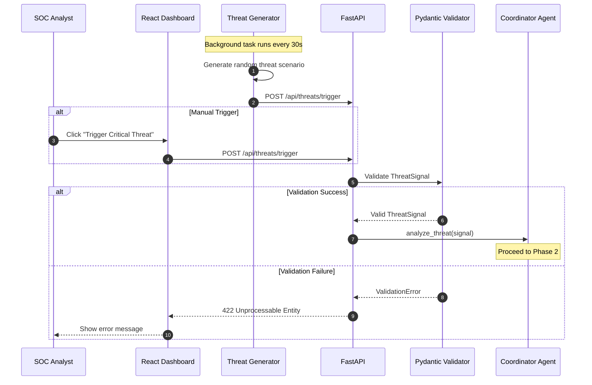
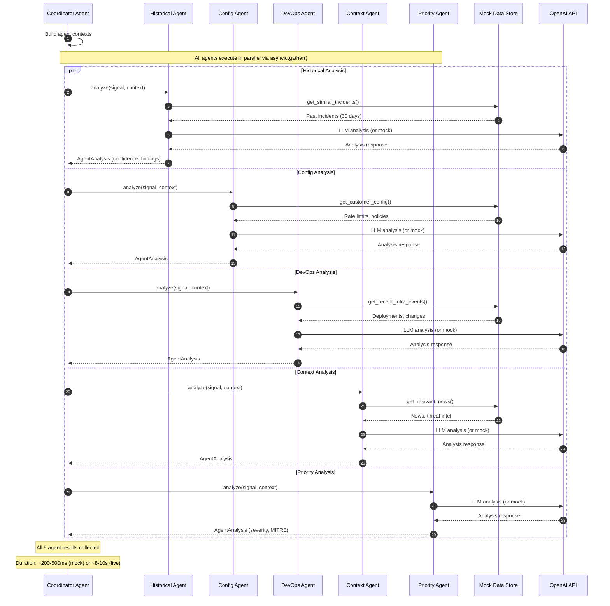
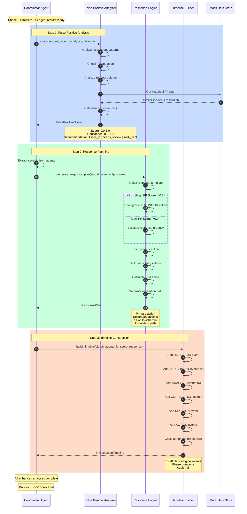
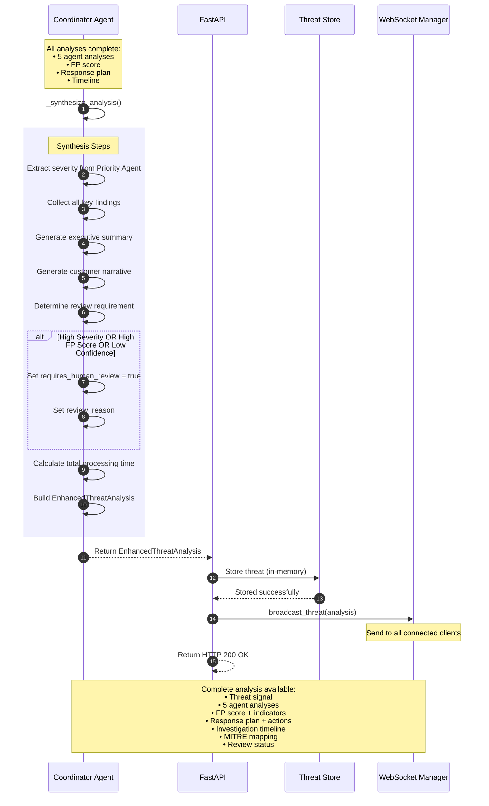
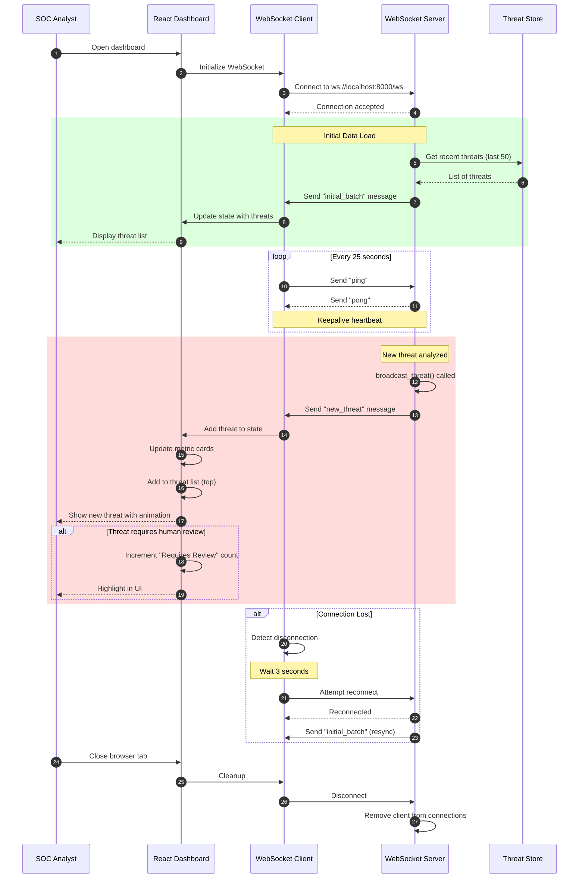
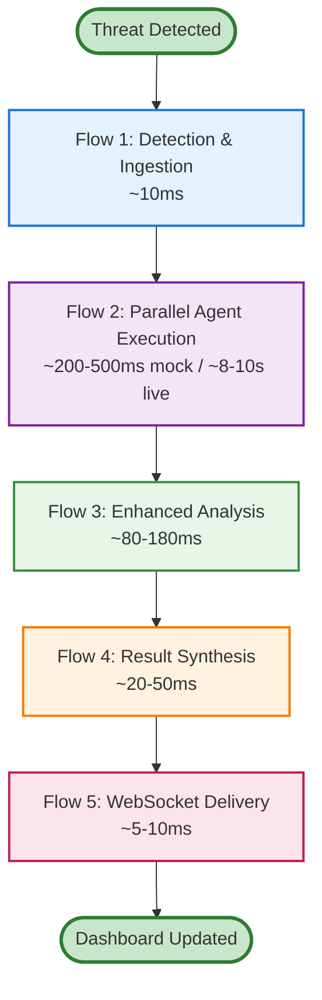
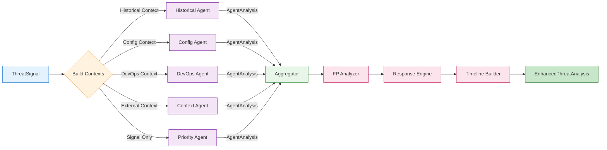
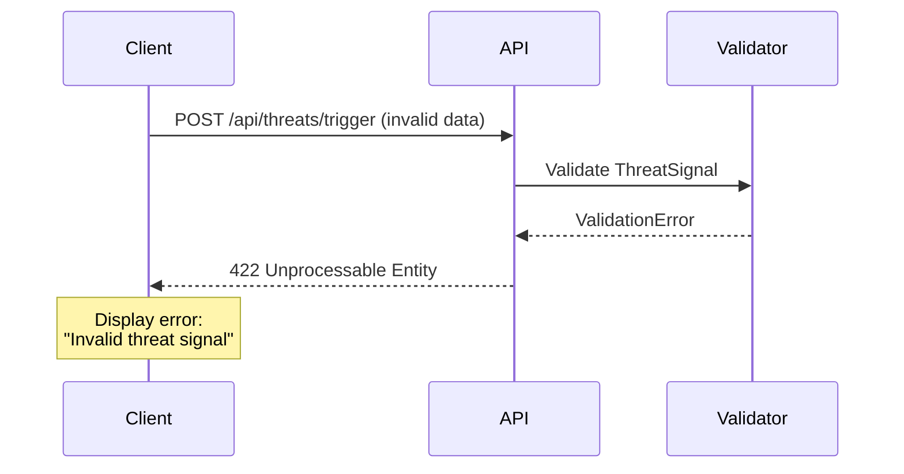
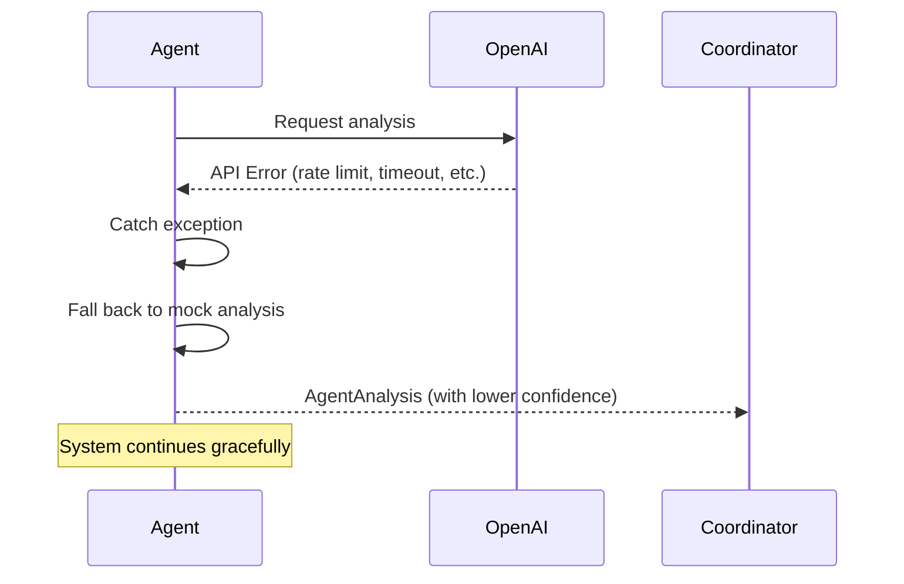
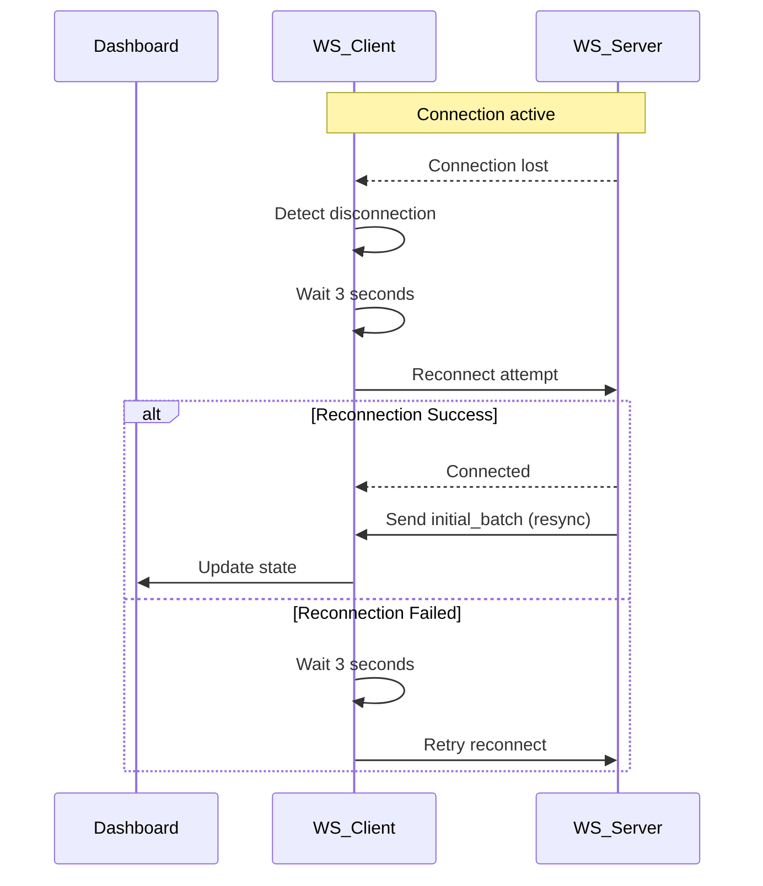

# SOC Agent System - Sequence Flow Diagrams

This document breaks down the complete threat analysis workflow into multiple easy-to-understand sequence diagrams.

---

## Table of Contents

1. [Overview](#overview)
2. [Flow 1: Threat Detection & Ingestion](#flow-1-threat-detection--ingestion)
3. [Flow 2: Parallel Agent Execution](#flow-2-parallel-agent-execution)
4. [Flow 3: Enhanced Analysis (FP, Response, Timeline)](#flow-3-enhanced-analysis-fp-response-timeline)
5. [Flow 4: Result Synthesis & Delivery](#flow-4-result-synthesis--delivery)
6. [Flow 5: WebSocket Real-time Updates](#flow-5-websocket-real-time-updates)

---

## Overview

The complete threat analysis workflow consists of 5 major phases:

1. **Detection & Ingestion** - Threat signal received and validated
2. **Parallel Agent Execution** - 5 specialized agents analyze concurrently
3. **Enhanced Analysis** - FP scoring, response planning, timeline building
4. **Result Synthesis** - Aggregation and final analysis generation
5. **Delivery** - Storage and real-time broadcast to dashboard

**Total Duration**: ~500-1000ms (mock mode) or ~10s (live OpenAI mode)

---

## Flow 1: Threat Detection & Ingestion

This flow shows how threats enter the system and get validated.

**Key Points:**
- Threats can be auto-generated (every 30s) or manually triggered
- All inputs are validated using Pydantic models
- Invalid threats are rejected before analysis begins

---

## Flow 2: Parallel Agent Execution

This flow shows how 5 specialized agents analyze the threat concurrently.

**Key Points:**
- All 5 agents run in parallel using `asyncio.gather()`
- Each agent has access to specialized data sources
- Mock mode bypasses OpenAI API for fast testing
- Each agent returns structured `AgentAnalysis` with confidence scores

---

## Flow 3: Enhanced Analysis (FP, Response, Timeline)

This flow shows the new production-grade analyzers that run after agent execution.

**Key Points:**
- These analyzers run **sequentially** after parallel agent execution
- **FP Analyzer**: Reduces false positives using pattern matching and historical data
- **Response Engine**: Maps threat+severity to actionable remediation steps
- **Timeline Builder**: Creates forensic audit trail for compliance
- Total overhead: <200ms for all three analyzers

---

## Flow 4: Result Synthesis & Delivery

This flow shows how all analysis results are aggregated and delivered.

**Key Points:**
- Coordinator synthesizes all results into a single `EnhancedThreatAnalysis` object
- Executive summary and customer narrative are generated
- Review requirement is determined based on severity, FP score, and confidence
- Results are stored and broadcast in real-time
- Total processing time is tracked for performance monitoring

---

## Flow 5: WebSocket Real-time Updates

This flow shows how the dashboard receives real-time threat updates.

**Key Points:**
- WebSocket connection established on dashboard load
- Initial batch of recent threats sent immediately
- Heartbeat ping/pong every 25 seconds to keep connection alive
- New threats broadcast to all connected clients in real-time
- Automatic reconnection with 3-second delay on connection loss
- Dashboard updates UI reactively without page refresh

---

## Complete End-to-End Flow Summary

Here's how all 5 flows connect together:

### Performance Breakdown

| Flow | Phase | Mock Mode | Live Mode |
|------|-------|-----------|-----------|
| **Flow 1** | Detection & Ingestion | ~10ms | ~10ms |
| **Flow 2** | Parallel Agent Execution | ~200-500ms | ~8-10s |
| **Flow 3** | Enhanced Analysis | ~80-180ms | ~80-180ms |
| **Flow 4** | Result Synthesis | ~20-50ms | ~20-50ms |
| **Flow 5** | WebSocket Delivery | ~5-10ms | ~5-10ms |
| **TOTAL** | **End-to-End** | **~500-1000ms** | **~10-12s** |

### Key Differences: Mock vs Live Mode

**Mock Mode** (No OpenAI API):
- ✅ Fast testing (~500ms per threat)
- ✅ No API costs
- ✅ Deterministic responses
- ❌ Simulated AI analysis

**Live Mode** (With OpenAI API):
- ✅ Real AI-powered analysis
- ✅ Context-aware insights
- ✅ Production-quality results
- ❌ Slower (~10s per threat)
- ❌ API costs (~$0.01 per threat)

---

## Agent Execution Details

### Data Flow Through Agents

---

## Error Handling Flows

### Validation Error Flow

### OpenAI API Error Flow

### WebSocket Reconnection Flow

---

## Conclusion

These sequence flows demonstrate:

1. **Modular Architecture** - Each phase is independent and testable
2. **Parallel Processing** - Agents run concurrently for speed
3. **Real-time Updates** - WebSocket ensures instant dashboard updates
4. **Error Resilience** - Graceful fallbacks at every layer
5. **Production-Ready** - Comprehensive analysis with FP detection, response planning, and audit trails

For more details, see:
- [Complete Architecture Documentation](./SOC_System_Architecture.md)
- [Architecture Diagrams](./soc-architecture.md)
- [Enhancement Guide](./SOC_Enhancement_Guide.md)

---

*Last Updated: 2026-02-05*

