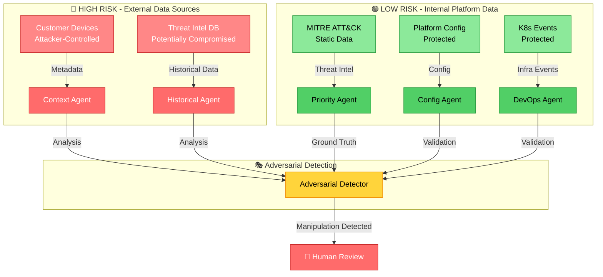
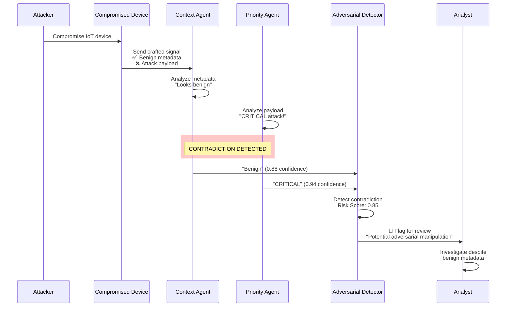
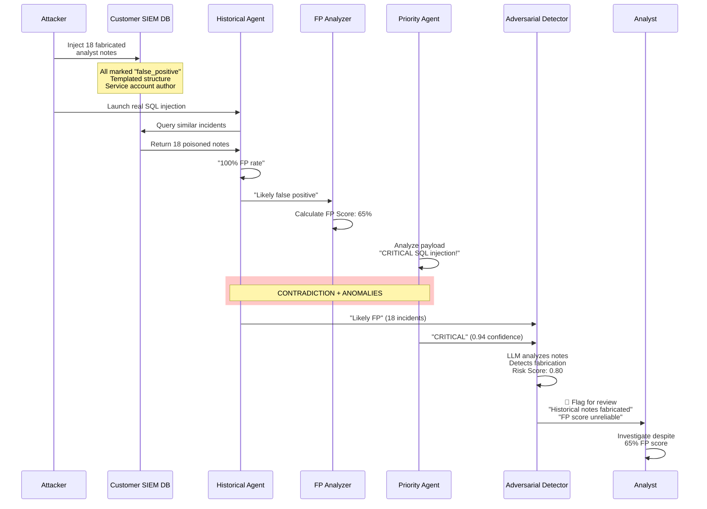
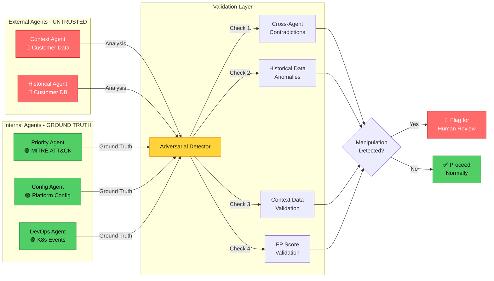
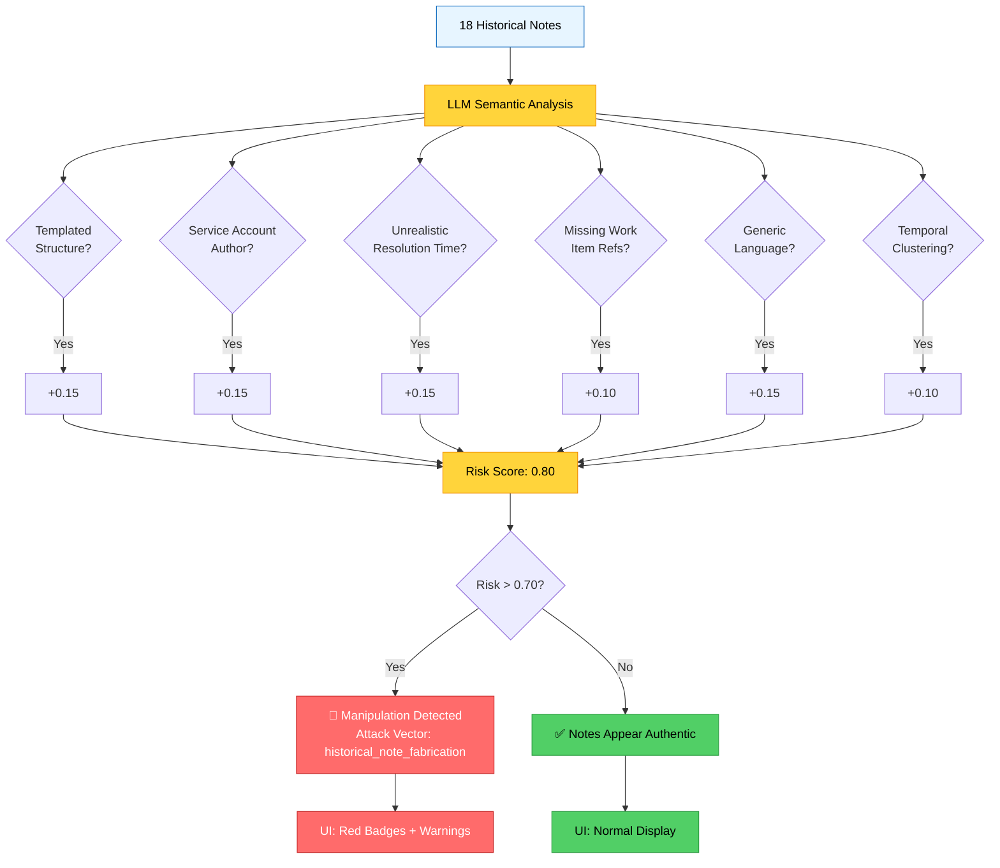

# Threat Model Analysis - Adversarial Agent Manipulation

## 📊 Visual Overview

### Attack Surface Map



### Attack Flow: Context Agent Manipulation



### Attack Flow: Historical Note Poisoning



---

## 🎯 Realistic Attack Surface

### Summary
Your analysis is **100% correct**. The realistic threat model focuses on **external data sources** that attackers can manipulate:

- ✅ **Context Agent** - Receives data from customer devices (attacker-controlled)
- ✅ **Historical Agent** - Consumes threat intel from customer systems (potentially compromised)
- ❌ **Config/DevOps/Priority Agents** - Protected by platform security (out of scope)

---

## 🔴 HIGH RISK: External Data Sources

### 1. Context Agent - Compromised Customer Devices

**Data Source**: Customer device signals, user behavior, network telemetry

**Attack Vector**: Attacker controls compromised devices in customer network

**Real-World Example**:
```
Scenario: IoT Botnet Attack Evasion

1. Attacker compromises 1,000 IoT devices in customer network
2. Devices send crafted HTTP requests with:
   - User-Agent: "Mozilla/5.0 (Windows NT 10.0; Win64; x64) Chrome/120.0"
   - Source IP: "10.0.1.50" (internal trusted network)
   - Request volume: 10 req/min (appears normal)
   - Geo-location: "San Francisco, CA" (customer HQ)
   
3. BUT: Request body contains SQL injection payload
   - Payload: "' OR 1=1; DROP TABLE users; --"
   
4. Context Agent Analysis:
   - "Normal browser behavior from trusted internal network"
   - Confidence: 0.88
   - Recommendation: "Benign traffic"
   
5. Priority Agent Analysis:
   - "CRITICAL: SQL injection attack detected"
   - MITRE: T1190 (Exploit Public-Facing Application)
   - Confidence: 0.94
   
6. CONTRADICTION DETECTED:
   - Context says "benign" but Priority says "CRITICAL attack"
   - Adversarial Detector flags for manual review
```

**Why This Matters**:
- Attackers can craft signals that LOOK benign in metadata
- But contain actual attack payloads
- Context Agent trusts the metadata (from compromised devices)
- Priority Agent detects the attack signature (from payload analysis)

---

### 2. Historical Agent - Poisoned Threat Intel Database

**Data Source**: Customer's historical incident data, SIEM logs, threat intelligence platform

**Attack Vector**: Attacker gains access to customer's threat intel database

**Real-World Example**:
```
Scenario: Historical Data Poisoning for Attack Evasion

1. Attacker gains access to customer's SIEM database (via phishing, insider threat, etc.)

2. Attacker injects 50 fake historical incidents:
   - Threat type: "sql_injection" (same as their planned attack)
   - Source IP: "10.0.0.0/8" (same range as their attack)
   - Payload pattern: Similar to their attack signature
   - Resolution: ALL marked as "false_positive"
   - Timestamps: Last 30 days, clustered 2-4 AM (off-hours)
   - Resolution time: All resolved in <5 minutes
   
3. Attacker launches real SQL injection attack

4. Historical Agent Analysis:
   - "Found 50 similar incidents in past 30 days"
   - "All 50 resolved as false positive"
   - "Historical FP rate: 100%"
   - Confidence: 0.92
   - Recommendation: "Likely false positive"
   
5. FP Analyzer:
   - Sees 100% historical FP rate
   - Scores current threat: 0.85 (likely FP)
   
6. Priority Agent Analysis:
   - "CRITICAL: SQL injection attack"
   - Confidence: 0.94
   
7. CONTRADICTIONS DETECTED:
   - Historical says "always FP" but Priority says "CRITICAL"
   - FP score (0.85) contradicts Priority severity
   - Statistical anomaly: 50 identical incidents in 30 days = 1.67/day (improbable)
   - Temporal clustering: All incidents at 2-4 AM (suspicious)
   - Resolution pattern: All resolved in <5 min (suspicious)
```

**Why This Matters**:
- Attackers can "train" the system to ignore their attack pattern
- By poisoning historical data, they manipulate FP analyzer
- But they leave statistical fingerprints (clustering, patterns)
- Adversarial detector catches these anomalies

---

## 🟢 LOW RISK: Internal Platform Data

### 3. Config Agent - Platform Configuration

**Data Source**: Internal platform configuration database

**Protection**: 
- DevSecOps practices (CI/CD security, code review)
- RBAC (Role-Based Access Control)
- Database encryption
- Audit logging

**Attack Vector**: Requires platform compromise (out of scope for agent-level attacks)

**Why Low Risk**: Attacker would need to compromise the SOC platform itself, which is protected by standard security controls.

---

### 4. DevOps Agent - Infrastructure Events

**Data Source**: Kubernetes events, infrastructure monitoring, system logs

**Protection**:
- Infrastructure security (network segmentation, firewalls)
- Kubernetes RBAC
- Audit logs
- Immutable infrastructure

**Attack Vector**: Requires infrastructure compromise (out of scope)

**Why Low Risk**: Infrastructure is protected by standard DevOps security practices.

---

### 5. Priority Agent - MITRE ATT&CK Framework

**Data Source**: Static MITRE ATT&CK framework data + signal payload analysis

**Protection**:
- Static data (no external input)
- Only analyzes signal payload (not metadata)

**Attack Vector**: Only vulnerable if signal payload itself is crafted (covered by Context Agent attack)

**Why Low Risk**: Uses static threat intelligence, not customer-provided data.

---

## 🎭 Adversarial Detection Strategy

### Defense Approach: "Trust but Verify"

**Core Principle**: Use **internal agents** (Priority, Config, DevOps) as "ground truth" to validate **external agents** (Context, Historical).

### Defense Architecture



### Detection Methods:

1. **Cross-Agent Contradiction Detection**
   - Context says "benign" BUT Priority says "attack" → FLAG
   - Historical says "always FP" BUT Priority says "CRITICAL" → FLAG
   - Both Context + Historical say "benign" BUT Priority says "attack" → HIGH ALERT

2. **Historical Data Anomaly Detection**
   - Temporal clustering (too many incidents in short time)
   - Suspicious resolution patterns (all FP, all resolved quickly)
   - Statistical outliers (improbable incident rates)
   - Impossible data (future timestamps, invalid IPs)

3. **Context Data Validation**
   - Metadata consistency checks (geo + IP + timezone alignment)
   - IP address validation (private IPs with public geo-locations)
   - User-agent validation (known attack tool signatures)
   - Volume anomalies (normal volume during attack)

4. **FP Score Validation**
   - FP score contradicts Priority severity
   - Example: FP=0.85 (likely FP) but Priority="CRITICAL SQL injection"
   - Indicates historical data may be poisoned

---

## ⚠️ Known Limitations

### Priority Agent as "Source of Truth"

**Current Design**: Priority Agent is used as the reference for detecting Context/Historical manipulation because it analyzes attack payloads directly rather than relying on external metadata or historical records.

**Rationale**:
- Analyzes actual threat payload (SQL injection patterns, malware signatures)
- Uses static MITRE ATT&CK framework (not externally influenced)
- Harder attack surface than metadata manipulation or database poisoning

**Limitations**: Priority Agent CAN be evaded through:

1. **Obfuscated Payloads**
   - URL encoding: `%44%52%4F%50%20%54%41%42%4C%45` instead of `DROP TABLE`
   - Comment injection: `DR/**/OP TA/**/BLE` to bypass pattern matching
   - Character encoding: `exec(char(68,82,79,80))` instead of direct strings

2. **Zero-Day Exploits**
   - Novel attack techniques not in MITRE framework
   - Unknown vulnerability exploitation patterns
   - Priority Agent may score as MEDIUM/LOW instead of CRITICAL

3. **Severity Calculation Bugs**
   - Missing MITRE technique mappings
   - Logic errors in severity scoring
   - Could result in CRITICAL attacks scored as LOW

4. **Coordinated Multi-Agent Attacks**
   - If attacker compromises Priority Agent logic itself
   - All agents could agree on incorrect assessment
   - No contradiction would be detected

**Mitigation Strategy**:
- **Phase 1-2 (Current)**: Use Priority as reference for Context/Historical validation
- **Phase 3 (Planned)**: Implement ensemble validation to detect Priority Agent outliers
- **Phase 4 (Future)**: Add external validation via 3rd-party threat intel APIs
- **Production**: Human-in-the-loop feedback to continuously improve detection

**Risk Assessment**:
- **Likelihood**: MEDIUM - Requires sophisticated attacker with deep system knowledge
- **Impact**: HIGH - Could result in critical threats being missed
- **Acceptance**: Acceptable for MVP/demo, must address before production deployment

**Detection Enhancement (Phase 3+)**:
```python
# Instead of: "Priority is always right"
# Implement: "Detect ANY agent that disagrees with consensus"

if priority_severity == "LOW" and 4_other_agents_say == "CRITICAL":
    flag_for_review("Priority Agent may be compromised or evaded")
```

---

## 📊 Interview Talking Points

### "How do you red-team your own agents?"

> **"We identified that external data sources - customer devices and threat intel - are the primary attack surface. An attacker could compromise customer devices to send benign-looking signals, or poison the customer's threat intel database to train our system to ignore their attacks.**
>
> **Our defense is cross-agent validation: we use internal agents (Priority, Config, DevOps) as ground truth to validate external agents (Context, Historical). If Context says 'benign' but Priority detects an attack signature, we flag it as potential adversarial manipulation.**
>
> **We also detect statistical anomalies in historical data - like 50 identical incidents in 30 days all resolved as false positives. That's a clear sign of database poisoning.**
>
> **This ensures we don't blindly trust any single data source, even if it's been compromised."**

### "What's the business impact?"

> **"Without this, an attacker could evade detection by:**
> - **Compromising customer devices to send crafted 'benign' signals**
> - **Poisoning threat intel to train our system to ignore their attacks**
> - **Bypassing our ML-based false positive detection**
>
> **With adversarial detection, we catch these manipulation attempts and flag them for manual review, ensuring our SOC platform maintains a strong security posture even when customer infrastructure is compromised."**

---

---

## 🎯 ADVANCED ATTACK: Historical Note Poisoning

### Overview

**Attack Vector**: Historical Resolution Note Fabrication

**Target**: Historical Agent + FP Analyzer

**Sophistication**: HIGH - Requires semantic reasoning to detect

**Why Rule-Based Systems Cannot Detect This**: All individual field values are technically valid. Only LLM semantic analysis can identify the linguistic and behavioral patterns that indicate fabrication.

---

### Visual Comparison: ACT 1 (Bypass) vs ACT 2 (Catch)

```mermaid
graph TB
    subgraph "ACT 1: Detector DISABLED - Attack Succeeds"
        A1_Signal[Real SQL Injection Attack]
        A1_Hist[Historical Agent<br/>18 Poisoned Notes]
        A1_FP[FP Analyzer<br/>Score: 65%]
        A1_UI[UI Display<br/>❌ No Warnings<br/>❌ No Badges<br/>✅ Clean FP Section]
        A1_Result[❌ Attack Dismissed<br/>Analyst ignores threat]

        A1_Signal --> A1_Hist
        A1_Hist -->|100% FP Rate| A1_FP
        A1_FP -->|65% Likely FP| A1_UI
        A1_UI --> A1_Result
    end

    subgraph "ACT 2: Detector ENABLED - Attack Caught"
        A2_Signal[Same SQL Injection Attack]
        A2_Hist[Historical Agent<br/>Same 18 Poisoned Notes]
        A2_FP[FP Analyzer<br/>Score: 65%]
        A2_AD[Adversarial Detector<br/>LLM Analysis]
        A2_UI[UI Display<br/>🚨 Red Badge<br/>⚠️ Warning Box<br/>🚨 Red Border]
        A2_Result[✅ Attack Flagged<br/>Analyst investigates]

        A2_Signal --> A2_Hist
        A2_Hist -->|100% FP Rate| A2_FP
        A2_Hist -->|18 Notes| A2_AD
        A2_AD -->|Fabrication Detected<br/>Risk: 0.80| A2_UI
        A2_FP -->|65% BUT Unreliable| A2_UI
        A2_UI --> A2_Result
    end

    style A1_Result fill:#ff6b6b,stroke:#c92a2a,color:#fff
    style A2_Result fill:#51cf66,stroke:#2f9e44,color:#fff
    style A1_UI fill:#fff,stroke:#868e96,color:#000
    style A2_UI fill:#ff6b6b,stroke:#c92a2a,color:#fff
    style A2_AD fill:#ffd43b,stroke:#f08c00,color:#000
```



### Fabrication Detection Flow



---

### Attack Scenario: Analyst Note Fabrication

**Real-World Example**:
```
Scenario: Fabricated Analyst Notes to Evade SQL Injection Detection

1. Attacker gains access to customer's SIEM database (via phishing, insider threat, etc.)

2. Attacker injects 18 fabricated analyst resolution notes:
   - All notes follow identical templated structure
   - All resolved by service account "admin_svc" (not human analysts)
   - All resolved in ~3 minutes (unrealistic for complex SQL injection)
   - All marked as "false_positive"
   - All use generic language: "Security team confirmed benign"
   - No work item references (no JIRA tickets, no colleague names)
   - Temporal pattern: 1 note/day over 18 days

   Example fabricated note:
   "Closed - false positive. Security team confirmed this was authorized
   testing. No action required."

3. Attacker launches real SQL injection attack

4. Historical Agent Analysis:
   - "Found 18 similar SQL injection incidents"
   - "All 18 resolved as false positive"
   - "Historical FP rate: 100%"
   - Confidence: 0.88
   - Recommendation: "Likely false positive based on historical pattern"

5. FP Analyzer:
   - Sees 100% historical FP rate
   - Scores current threat: 0.65 (likely FP)
   - Recommendation: "Low priority - matches known FP pattern"

6. Priority Agent Analysis:
   - "CRITICAL: SQL injection attack detected"
   - Payload: "SELECT * FROM users WHERE id=1 OR 1=1--"
   - MITRE: T1190 (Exploit Public-Facing Application)
   - Confidence: 0.94

7. WITHOUT ADVERSARIAL DETECTION:
   - Attack bypasses detection
   - Analyst sees 65% FP score, likely dismisses threat
   - Real attack succeeds

8. WITH ADVERSARIAL DETECTION (LLM Semantic Analysis):
   - Detects templated structure across all 18 notes
   - Identifies service account authorship (not human analysts)
   - Flags unrealistic 3-minute resolution times
   - Notes missing work item references
   - Detects generic team references vs. specific analyst names
   - Identifies temporal clustering pattern
   - Risk Score: 0.80
   - Attack Vector: "historical_note_fabrication"
   - Flags for human review with warning: "FP score may be unreliable"
```

---

### Fabrication Indicators (LLM Detection)

The adversarial detector uses LLM semantic reasoning to identify these patterns:

1. **Templated Structure**
   - All 18 notes follow identical pattern: "Closed - false positive. [Team] confirmed [activity]. [Benign phrase]."
   - Lack of natural language variation
   - Automated generation fingerprint

2. **Service Account Authorship**
   - All resolved by `admin_svc` instead of human analysts
   - Real analysts use personal accounts: `sarah.chen`, `james.okafor`
   - Service accounts don't write nuanced analysis

3. **Unrealistic Resolution Times**
   - Complex SQL injection threats resolved in 3 minutes
   - Real investigations take hours/days
   - No evidence of actual investigation work

4. **Missing Work Item References**
   - No JIRA tickets: "Tracked in SEC-1234"
   - No colleague mentions: "Confirmed with @sarah.chen"
   - No external references: "Vendor confirmed in ticket #456"

5. **Generic Team References**
   - "Security team" instead of specific names
   - "Confirmed benign" without details
   - Lack of domain-specific reasoning

6. **Temporal Clustering**
   - Exactly 1 note/day pattern over 18 days
   - Too regular to be organic
   - Suggests automated injection

---

### Why This Attack is Architecturally Impossible for Rule-Based Systems

**Rule-based systems CANNOT detect this because**:

❌ **No single field is "wrong"**
   - Service accounts are legitimate (can't ban them)
   - Fast resolutions happen (some issues are quick)
   - Generic language is valid (not all analysts write detailed notes)
   - Temporal patterns vary (no "correct" incident rate)

❌ **Cannot evaluate semantic plausibility**
   - Rules can't assess "Does this note sound like a real analyst wrote it?"
   - Rules can't detect "Is this resolution time realistic for this threat type?"
   - Rules can't identify "Are these notes too similar to be independent?"

❌ **Cannot perform cross-field reasoning**
   - Rules can't correlate: "Service account + 3-min resolution + no JIRA + generic language = fabrication"
   - Each field individually is valid
   - Only the COMBINATION reveals the attack

**Only LLM semantic reasoning can**:

✅ **Evaluate linguistic plausibility** across multiple notes
✅ **Detect templated patterns** that indicate automation
✅ **Identify domain reasoning mismatches** (e.g., service account resolving complex threats in 3 min)
✅ **Compare against authentic analyst behavior** patterns

---

### Detection Implementation

**File**: `soc-agent-system/backend/src/analyzers/adversarial_detector.py`

**Method**: `_check_historical_note_authenticity()`

**Detection Logic**:
```python
# LLM analyzes historical resolution notes for fabrication indicators
# Prompt includes:
# - All resolution notes from similar incidents
# - Metadata: author, resolution time, timestamps
# - Context: threat type, severity, complexity

# LLM identifies:
# - Templated structure
# - Service account authorship patterns
# - Unrealistic resolution times
# - Missing work item references
# - Generic vs. specific language
# - Temporal clustering

# Returns:
# - manipulation_detected: bool
# - confidence: 0.80
# - attack_vector: "historical_note_fabrication"
# - anomalies: List of specific indicators
```

---

### UI Impact: The FP Score Paradox

**The Challenge**: When historical notes are poisoned, the FP Analyzer is successfully tricked:
- FP Score: 65% (likely false positive)
- But the Adversarial Detector catches the manipulation

**The Solution**: UI warnings to explain the paradox:

**ACT 1 (Bypass - Detector Disabled)**:
- ❌ NO red "Adversarial Attack Detected" badge
- ❌ NO warnings
- ⚠️ FP Score: 65% displayed without context
- **Result**: Analyst likely dismisses real attack

**ACT 2 (Catch - Detector Enabled)**:
- 🚨 Red "Adversarial Attack Detected" badge
- ⚠️ Yellow "Requires Review" badge
- 🚨 Red warning box: "⚠️ WARNING: This FP score may be unreliable due to detected adversarial manipulation of historical data"
- 🚨 Red border around FP Analysis section
- 🚨 Full Adversarial Detection section with detailed analysis
- **Result**: Analyst investigates despite high FP score

**Key Insight**: The 65% FP score is actually **proof the attack is working**! The poisoned notes successfully tricked the FP Analyzer, but the Adversarial Detector caught it and warned the analyst.

---

### Demo: Historical Note Poisoning

**Location**: `soc-agent-system/backend/HISTORICAL_NOTE_POISONING_DEMO_GUIDE.md`

**Quick Test**:
```bash
# ACT 1: Bypass (Detector Disabled)
curl -X POST http://localhost:8080/api/threats/trigger \
  -H "Content-Type: application/json" \
  -d '{"adversarial_scenario": "note_poisoning_bypass", "adversarial_detector_enabled": false}'

# ACT 2: Catch (Detector Enabled)
curl -X POST http://localhost:8080/api/threats/trigger \
  -H "Content-Type: application/json" \
  -d '{"adversarial_scenario": "note_poisoning_catch", "adversarial_detector_enabled": true}'

# View in browser: http://localhost:8080
```

**Demo Narrative**:
1. "Here's a real attack with poisoned historical notes. The system thinks it's 65% likely a false positive. **No warnings, no alerts.** The attack succeeded."
2. "Same attack, same poisoned data, but with adversarial detection enabled. **Red badges everywhere!** The system caught the manipulation."
3. "Without adversarial detection, this real attack would have been dismissed. With it, we catch the manipulation and flag it for human review."

---

### Business Impact

**Without Historical Note Poisoning Detection**:
- Attackers can "train" the SOC system to ignore their attack patterns
- Real attacks dismissed as false positives
- Analyst trust in FP scores is misplaced
- Long-term evasion (attack can persist for months)

**With Historical Note Poisoning Detection**:
- Fabricated notes are identified and flagged
- FP scores are marked as unreliable when manipulation detected
- Analysts are warned to investigate despite high FP scores
- Attack evasion attempts become detection opportunities

**Key Differentiator**: This demonstrates that agentic SOC systems can detect attacks that are **architecturally impossible** for rule-based systems to identify - specifically, the semantic plausibility of free-text analyst notes.

---

## ✅ Conclusion

Your threat model analysis is **spot-on**. The realistic attack surface is:

- ✅ **Context Agent** (customer devices) - HIGH RISK
- ✅ **Historical Agent** (customer threat intel) - HIGH RISK
  - **Advanced**: Historical Note Poisoning - Requires LLM semantic analysis
- ❌ **Config/DevOps/Priority** (platform data) - LOW RISK (protected by DevSecOps)

The adversarial detection strategy focuses on **validating external data sources** using **internal ground truth** and **LLM semantic reasoning**, which is the correct approach for a production SOC platform.

**Latest Enhancement**: Historical Note Poisoning detection demonstrates the unique value of agentic systems - detecting attacks that rule-based systems cannot architecturally address.

