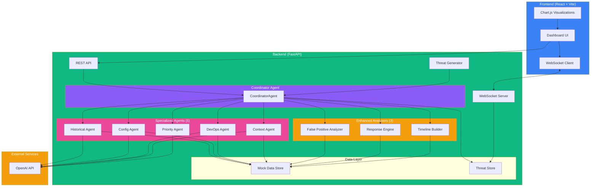
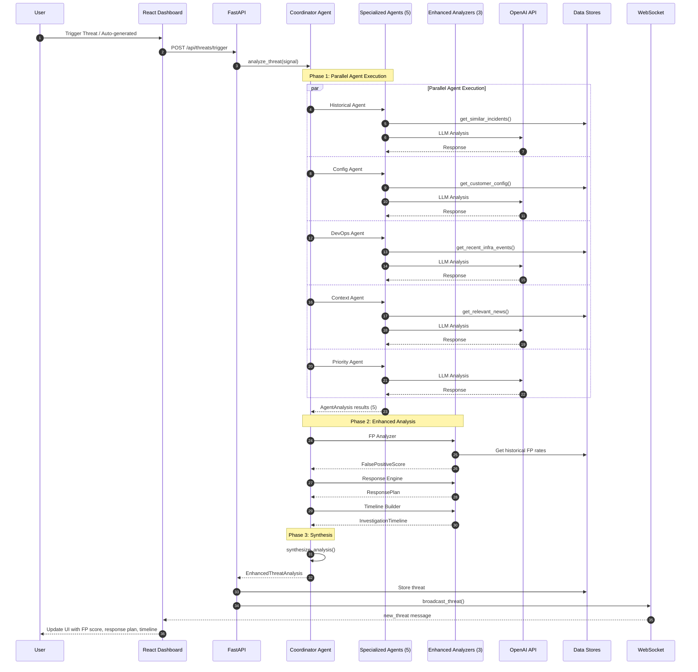
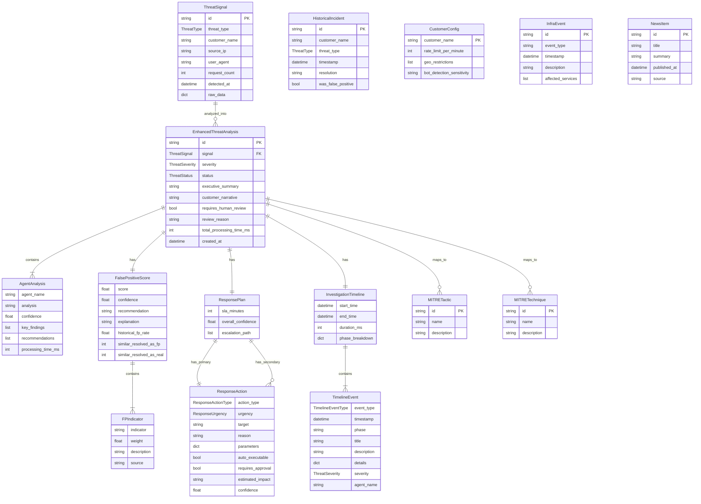
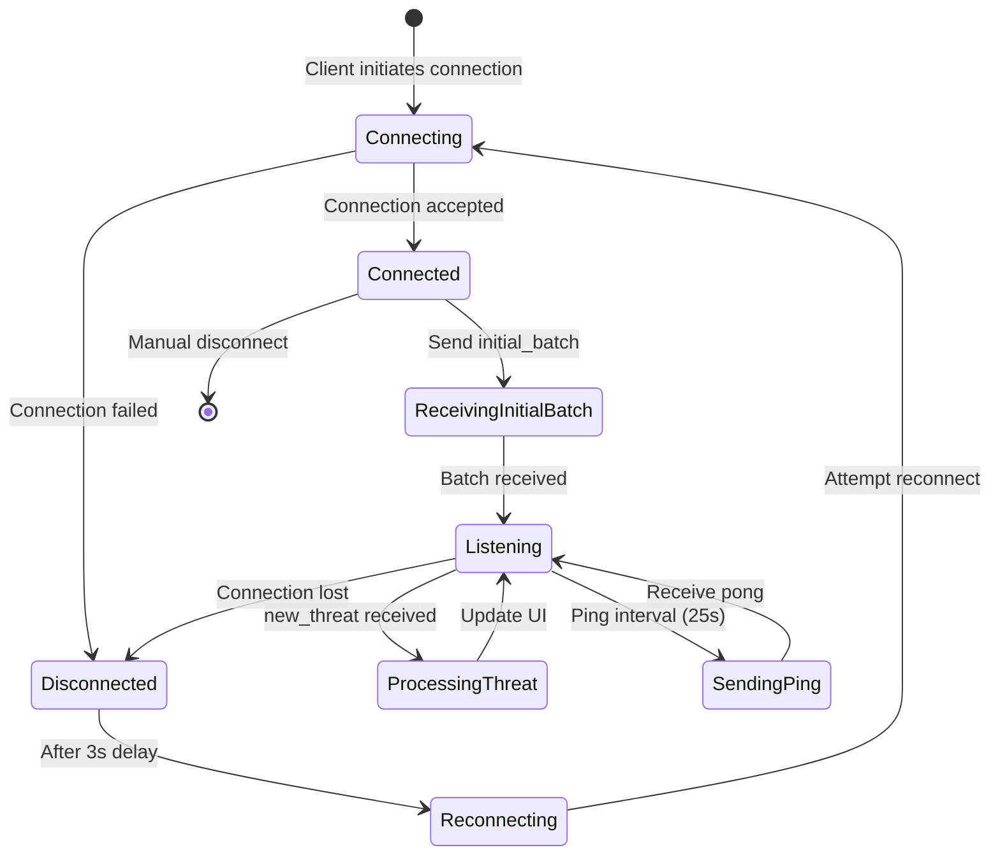
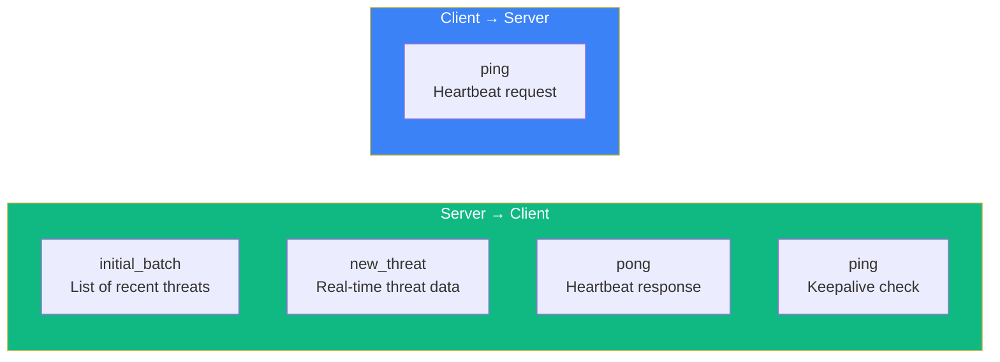
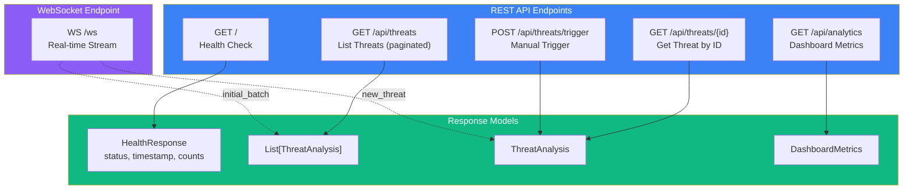
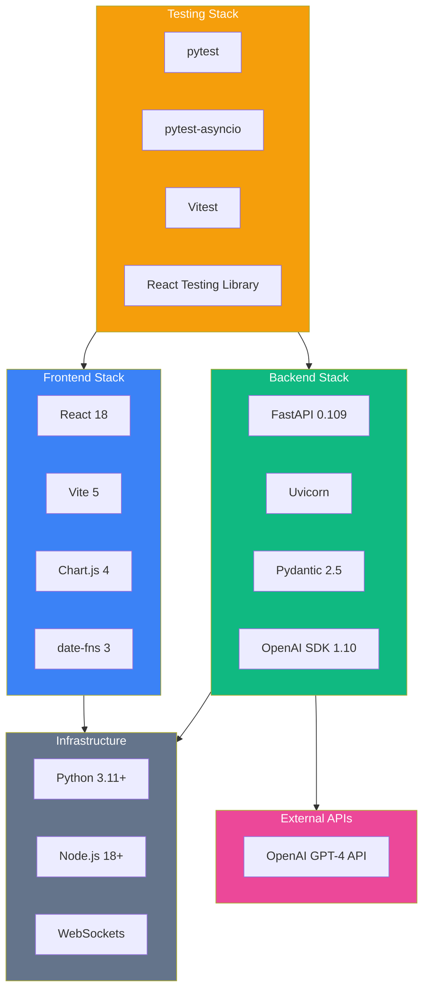
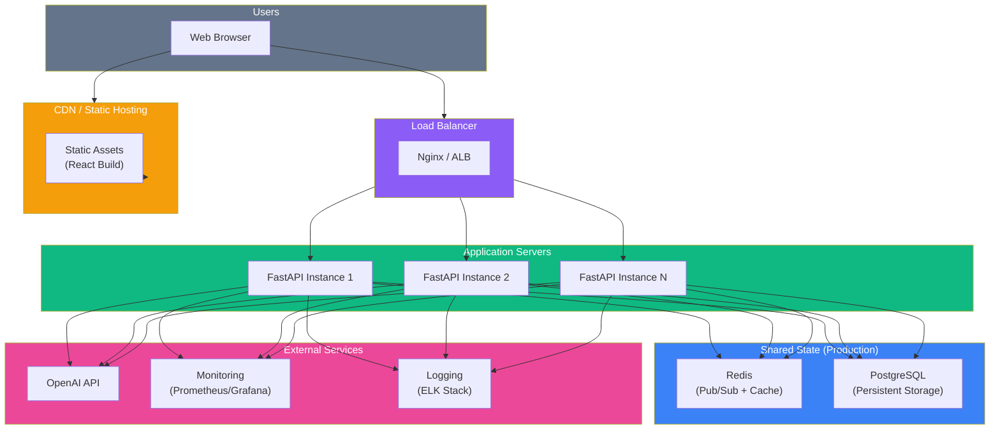

# SOC Agent System - Architecture Diagrams

A comprehensive visual documentation of the SOC Agent System architecture using Mermaid diagrams.

---

## Table of Contents

1. [System Overview](#1-system-overview)
2. [Request Flow Sequence](#2-request-flow-sequence)
3. [Agent System Architecture](#3-agent-system-architecture)
4. [Data Models](#4-data-models)
5. [WebSocket Communication](#5-websocket-communication)
6. [API Endpoints](#6-api-endpoints)
7. [Technology Stack](#7-technology-stack)
8. [Deployment Architecture](#8-deployment-architecture)

---

## 1. System Overview

High-level component architecture showing the main system components and their interactions.

---

## 2. Request Flow Sequence

Sequence diagram showing the complete flow of a threat analysis request with enhanced analyzers.

---

## 3. Agent System Architecture

Class diagram showing the agent inheritance, analyzers, and relationships.

```mermaid
classDiagram
    class BaseAgent {
        <<abstract>>
        +name: str
        +client: AsyncOpenAI
        +get_system_prompt()* str
        +build_user_prompt(signal, context)* str
        +analyze(signal, context) AgentAnalysis
        +analyze_mock(signal, context) AgentAnalysis
    }

    class HistoricalAgent {
        +name: "Historical Agent"
        +get_system_prompt() str
        +build_user_prompt(signal, context) str
    }

    class ConfigAgent {
        +name: "Config Agent"
        +get_system_prompt() str
        +build_user_prompt(signal, context) str
    }

    class DevOpsAgent {
        +name: "DevOps Agent"
        +get_system_prompt() str
        +build_user_prompt(signal, context) str
    }

    class ContextAgent {
        +name: "Context Agent"
        +get_system_prompt() str
        +build_user_prompt(signal, context) str
    }

    class PriorityAgent {
        +name: "Priority Agent"
        +get_system_prompt() str
        +build_user_prompt(signal, context) str
    }

    class FalsePositiveAnalyzer {
        +analyze(signal, analyses, incidents) FalsePositiveScore
        -_analyze_user_agent(signal) float
        -_analyze_ip(signal) float
        -_analyze_request_volume(signal) float
        -_analyze_historical_patterns(signal, incidents) float
        -_calculate_score(indicators) FalsePositiveScore
    }

    class ResponseActionEngine {
        +generate_response_plan(signal, severity, fp_score, config) ResponsePlan
        -_select_template(threat_type, severity) dict
        -_build_primary_action(template, signal) ResponseAction
        -_build_secondary_actions(template, signal) List
        -_calculate_sla(severity) int
        -_build_escalation_path(severity, config) List
    }

    class TimelineBuilder {
        +build_timeline(signal, analyses, fp_score, response) InvestigationTimeline
        -_add_detection_event(signal) TimelineEvent
        -_add_enrichment_events(signal) List
        -_add_agent_analysis_events(analyses) List
        -_add_fp_analysis_event(fp_score) TimelineEvent
        -_add_decision_event(severity) TimelineEvent
        -_add_response_events(response) List
    }

    class CoordinatorAgent {
        +mock_data: MockDataStore
        +client: AsyncOpenAI
        +use_mock: bool
        +historical_agent: HistoricalAgent
        +config_agent: ConfigAgent
        +devops_agent: DevOpsAgent
        +context_agent: ContextAgent
        +priority_agent: PriorityAgent
        +fp_analyzer: FalsePositiveAnalyzer
        +response_engine: ResponseActionEngine
        +timeline_builder: TimelineBuilder
        +analyze_threat(signal) EnhancedThreatAnalysis
        -_build_agent_contexts(signal) Dict
        -_synthesize_analysis(signal, analyses, time, severity, fp_score, response, timeline) EnhancedThreatAnalysis
        -_generate_executive_summary(signal, severity, findings) str
    }

    BaseAgent <|-- HistoricalAgent
    BaseAgent <|-- ConfigAgent
    BaseAgent <|-- DevOpsAgent
    BaseAgent <|-- ContextAgent
    BaseAgent <|-- PriorityAgent

    CoordinatorAgent o-- HistoricalAgent
    CoordinatorAgent o-- ConfigAgent
    CoordinatorAgent o-- DevOpsAgent
    CoordinatorAgent o-- ContextAgent
    CoordinatorAgent o-- PriorityAgent
    CoordinatorAgent o-- FalsePositiveAnalyzer
    CoordinatorAgent o-- ResponseActionEngine
    CoordinatorAgent o-- TimelineBuilder
```

---

## 4. Data Models

Entity relationship diagram showing the enhanced data model structure.

---

## 5. WebSocket Communication

State diagram showing WebSocket connection lifecycle and message flow.

### WebSocket Message Types

---

## 6. API Endpoints

Flowchart showing all available API endpoints and their relationships.

---

## 7. Technology Stack

Comprehensive view of the technology stack.

---

## 8. Deployment Architecture

Production deployment architecture diagram.

---

## Agent & Analyzer Responsibilities Summary

### Specialized Agents (5)

| Agent | Primary Function | Data Sources | Key Outputs |
|-------|------------------|--------------|-------------|
| **Historical** | Pattern recognition | Past incidents (30 days) | Similar incidents, false positive rates |
| **Config** | Policy compliance | Customer configurations | Rate limit violations, config issues |
| **DevOps** | Infrastructure correlation | Recent infra events | Deployment correlations, platform issues |
| **Context** | Business intelligence | News, market data | External factors, legitimate surge detection |
| **Priority** | Threat classification | All agent outputs | MITRE mapping, severity, customer narrative |

### Enhanced Analyzers (3)

| Analyzer | Primary Function | Inputs | Key Outputs |
|----------|------------------|--------|-------------|
| **False Positive Analyzer** | ML-based FP detection | Signal, agent analyses, historical incidents | FP score (0-1), confidence, indicators, recommendation |
| **Response Action Engine** | Automated remediation | Signal, severity, FP score, customer config | Primary/secondary actions, SLA times, escalation path |
| **Timeline Builder** | Forensic reconstruction | Signal, agent analyses, FP score, response plan | Chronological events, phase breakdown, audit trail |

---

## Key Architecture Patterns

1. **Multi-Agent Pattern**: Specialized agents with single responsibilities
2. **Parallel Execution**: `asyncio.gather()` for concurrent agent analysis
3. **Event-Driven Updates**: WebSocket for real-time threat streaming
4. **Mock Mode**: Testing without external API dependencies
5. **Factory Pattern**: `create_coordinator()` for flexible instantiation

---

## Performance Characteristics

| Metric | Target | Implementation |
|--------|--------|----------------|
| Agent Parallelism | 5 concurrent | `asyncio.gather()` |
| Analyzer Execution | Sequential | After agent completion |
| Total Analysis Time (Mock) | ~500-1000ms | No OpenAI API calls |
| Total Analysis Time (Live) | ~10-12s | With OpenAI API |
| WebSocket Keepalive | 25 seconds | Client-side ping interval |
| Reconnect Delay | 3 seconds | Exponential backoff recommended for production |
| Max Stored Threats | 50 | Configurable via environment |
| Threat Generation | 30 seconds | Background task interval |

### Analysis Phase Breakdown

| Phase | Components | Mock Mode | Live Mode |
|-------|-----------|-----------|-----------|
| **Phase 1** | 5 Agents (parallel) | ~200-500ms | ~8-10s |
| **Phase 2** | FP Analyzer | ~50-100ms | ~50-100ms |
| **Phase 3** | Response Engine | ~20-50ms | ~20-50ms |
| **Phase 4** | Timeline Builder | ~10-30ms | ~10-30ms |
| **Phase 5** | Synthesis & Delivery | ~20-50ms | ~20-50ms |
| **TOTAL** | **End-to-End** | **~500-1000ms** | **~10-12s** |

---

*Generated for SOC Agent System v2.0.0 - Enhanced with FP Detection, Response Planning, and Timeline Reconstruction*
