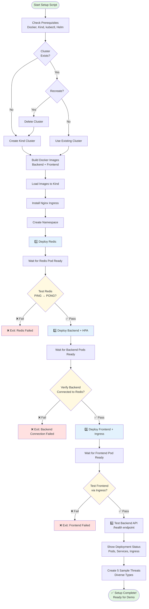

# SOC Agent System — Kubernetes Demo Guide

This directory contains scripts for demonstrating the SOC Agent System running on Kubernetes during interviews or presentations.

## 🔄 Sequential Deployment Flow

The setup script follows a proper dependency chain with testing at each stage to ensure reliability:



**Key Benefits:**
- ✅ **No Race Conditions**: Each component waits for its dependencies
- ✅ **Fail Fast**: Script exits immediately if any component fails
- ✅ **Guaranteed Redis Connection**: Backend never falls back to in-memory store
- ✅ **Clear Error Messages**: Know exactly what failed and where
- ✅ **Production-Ready**: Follows deployment best practices

## 📁 Contents

- **`setup_demo.sh`** - Pre-demo setup script (run once before demo, takes 3-5 minutes)
- **`run_demo.sh`** - Quick interactive demo script (for live presentation)
- **`generate_threat_with_openai.sh`** - Generate a threat using live OpenAI API (for interviewer demo)
- **`revert_to_mock_mode.sh`** - Revert backend to mock mode (no API costs)
- **`access_observability.sh`** - Access observability dashboards (Prometheus, Grafana, Jaeger)
- **`teardown_demo.sh`** - Cleanup script to remove all resources
- **`README.md`** - This file

## 🎯 Quick Start

### Before Your Interview/Demo

Run the setup script to prepare the environment:

```bash
bash soc-agent-system/k8s/demo/setup_demo.sh
```

This will:
- ✅ Create a Kind cluster with 3 nodes
- ✅ Build and load Docker images
- ✅ Install Nginx Ingress Controller
- ✅ Deploy SOC Agent System with Helm
- ✅ Configure HPA (2-8 replicas)
- ✅ Pre-populate sample data
- ⏱️ Takes 3-5 minutes

### During Your Interview/Demo

Run the demo script for a quick interactive demonstration:

```bash
bash soc-agent-system/k8s/demo/run_demo.sh
```

This will:
- ✅ Verify environment is ready
- ✅ Set up port-forwards (backend on 9080, frontend on 9081)
- ✅ Open dashboards in browser
- ✅ Run Locust load test (2 minutes, 20 users)
- ✅ Show system state and HPA status
- ⏱️ Takes ~3 minutes

### After Your Demo

Clean up resources:

```bash
# Keep cluster for quick re-runs
bash soc-agent-system/k8s/demo/teardown_demo.sh

# Or delete everything including cluster
bash soc-agent-system/k8s/demo/teardown_demo.sh --delete-cluster
```

## 📋 Prerequisites

Make sure you have these tools installed:

- **Docker** - For building images
- **Kind** - For local Kubernetes cluster
- **kubectl** - For Kubernetes CLI
- **Helm** - For deploying charts
- **Locust** (optional) - For load testing
  - Install: `pip install locust`
  - Or use existing venv: `soc-agent-system/backend/venv/bin/locust`

Check prerequisites:

```bash
docker --version
kind --version
kubectl version --client
helm version
locust --version  # optional
```

## 🏗️ Architecture Overview

The demo showcases a production-ready Kubernetes deployment:

```
┌─────────────────────────────────────────────────────────┐
│                    Kind Cluster                         │
│  ┌───────────────────────────────────────────────────┐  │
│  │           Nginx Ingress Controller                │  │
│  │         (localhost:8080 → services)               │  │
│  └───────────────────────────────────────────────────┘  │
│                          │                              │
│  ┌───────────────────────┴───────────────────────────┐  │
│  │                                                    │  │
│  │  ┌──────────────┐         ┌──────────────┐       │  │
│  │  │   Backend    │◄────────┤   Frontend   │       │  │
│  │  │  (2-8 pods)  │         │   (1 pod)    │       │  │
│  │  │     HPA      │         └──────────────┘       │  │
│  │  └──────┬───────┘                                │  │
│  │         │                                         │  │
│  │         ▼                                         │  │
│  │  ┌──────────────┐                                │  │
│  │  │    Redis     │                                │  │
│  │  │  (1 pod)     │                                │  │
│  │  │  Pub/Sub     │                                │  │
│  │  └──────────────┘                                │  │
│  │                                                    │  │
│  └────────────────────────────────────────────────────┘  │
└─────────────────────────────────────────────────────────┘
```

## 🔑 Key Features Demonstrated

### 1. **Kubernetes Deployment**
- Multi-node Kind cluster (1 control-plane, 2 workers)
- Helm charts for declarative deployment
- Proper resource limits and requests

### 2. **Horizontal Pod Autoscaler (HPA)**
- Configured for 2-8 replicas
- CPU-based scaling (70% target)
- Automatic scale-up under load

### 3. **High Availability**
- Multiple backend pods for redundancy
- Rolling updates with zero downtime
- Health checks and readiness probes

### 4. **State Management**
- Redis for cross-pod state sharing
- Pub/Sub for real-time updates
- Session persistence across pods

### 5. **Ingress & Networking**
- Nginx Ingress Controller
- Host-based routing
- Service mesh ready

### 6. **Load Testing**
- Locust-based performance testing
- Multiple user scenarios
- HTML reports with metrics

## 📊 Access Points

### Via Port-Forward (Recommended for Demo)

```bash
# Backend API
curl http://localhost:9080/health
curl http://localhost:9080/api/threats

# Frontend
open http://localhost:9081
```

### Via Ingress

```bash
# With Host header
curl -H "Host: soc-agent.local" http://localhost:8080/
curl -H "Host: soc-agent.local" http://localhost:8080/health

# Or add to /etc/hosts
echo "127.0.0.1 soc-agent.local" | sudo tee -a /etc/hosts
open http://soc-agent.local:8080
```

## 🧪 Manual Testing

### Check Deployment Status

```bash
# All resources
kubectl get all -n soc-agent-demo

# Pods
kubectl get pods -n soc-agent-demo -o wide

# HPA status
kubectl get hpa -n soc-agent-demo

# Ingress
kubectl get ingress -n soc-agent-demo
```

### Test API Endpoints

```bash
# Health check
curl http://localhost:9080/health

# List threats
curl http://localhost:9080/api/threats

# Create threat
curl -X POST http://localhost:9080/api/threats/trigger \
  -H "Content-Type: application/json" \
  -d '{"threat_type": "bot_traffic"}'
```

### View Logs

```bash
# Backend logs
kubectl logs -n soc-agent-demo -l app=soc-backend --tail=50

# Frontend logs
kubectl logs -n soc-agent-demo -l app=soc-frontend --tail=50

# Redis logs
kubectl logs -n soc-agent-demo -l app=redis --tail=50
```

### Access Observability Dashboards

```bash
# Start port-forwards to observability stack
bash soc-agent-system/k8s/demo/access_observability.sh
```

This will set up port-forwards for:
- **Prometheus** (http://localhost:9090) - Metrics and queries
- **Grafana** (http://localhost:3000) - Dashboards (if running)
- **Jaeger** (http://localhost:16686) - Distributed tracing
- **AlertManager** (http://localhost:9093) - Alert management

**Useful Prometheus Queries:**
```promql
# Request rate
rate(http_requests_total[5m])

# Error rate
rate(http_requests_total{status=~"5.."}[5m])

# Pod CPU usage
container_cpu_usage_seconds_total{namespace="soc-agent-demo"}

# Pod memory usage
container_memory_usage_bytes{namespace="soc-agent-demo"}

# HPA current replicas
kube_horizontalpodautoscaler_status_current_replicas{namespace="soc-agent-demo"}
```

**Manual Port-Forward (Alternative):**
```bash
# Prometheus
kubectl port-forward -n observability svc/kube-prometheus-stack-prometheus 9090:9090

# Jaeger
kubectl port-forward -n observability svc/jaeger 16686:16686

# Grafana (if running)
kubectl port-forward -n observability svc/kube-prometheus-stack-grafana 3000:80

# Get Grafana password
kubectl get secret -n observability kube-prometheus-stack-grafana -o jsonpath="{.data.admin-password}" | base64 --decode
```

## 🐛 Troubleshooting

### Pods Not Starting

```bash
# Check pod status
kubectl get pods -n soc-agent-demo

# Describe pod for events
kubectl describe pod <pod-name> -n soc-agent-demo

# Check logs
kubectl logs <pod-name> -n soc-agent-demo
```

### Ingress Not Working

```bash
# Check ingress controller
kubectl get pods -n ingress-nginx

# Check ingress resource
kubectl describe ingress -n soc-agent-demo

# Test with curl
curl -v -H "Host: soc-agent.local" http://localhost:8080/
```

### Port-Forward Issues

```bash
# Kill existing port-forwards
pkill -f "kubectl port-forward"

# Restart port-forwards
kubectl port-forward -n soc-agent-demo svc/soc-agent-backend 9080:8000 &
kubectl port-forward -n soc-agent-demo svc/soc-agent-frontend 9081:80 &
```

### HPA Not Scaling

```bash
# Check HPA status
kubectl get hpa -n soc-agent-demo
kubectl describe hpa -n soc-agent-demo

# Note: HPA requires metrics-server (not installed by default in Kind)
# For demo purposes, show the HPA configuration instead of live scaling
```

## 📝 Demo Tips

1. **Run setup_demo.sh the night before** - Ensures everything is ready
2. **Test run_demo.sh once** - Familiarize yourself with the flow
3. **Keep DEMO_SCRIPT.md open** - Reference talking points
4. **Have kubectl commands ready** - Show live cluster state
5. **Explain architecture first** - Then show it working
6. **Highlight production features** - HPA, rolling updates, Redis Pub/Sub

## 🔄 Re-running the Demo

If you keep the cluster running (don't use `--delete-cluster`):

```bash
# Quick re-run (uses existing cluster and images)
bash soc-agent-system/k8s/demo/setup_demo.sh
bash soc-agent-system/k8s/demo/run_demo.sh
```

This is much faster (~1 minute) since images are already loaded!

## 📚 Additional Resources

- **Helm Chart**: `soc-agent-system/k8s/charts/soc-agent/`
- **Dockerfiles**: `soc-agent-system/k8s/docker/`
- **Test Suites**: `soc-agent-system/k8s/tests/`
- **Load Tests**: `soc-agent-system/loadtests/`

## 🎓 Cheat Sheet

1. cluster stats - kubectl get all -n soc-agent-demo
2. If ingress issue then check if local host is being used incorrectly
3. For manual testing curl -X POST http://localhost:8080/api/threats/trigger \
  -H "Content-Type: application/json" \
  -d '{"threat_type": "bot_traffic"}'

